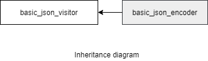

### jsoncons::basic_json_encoder

```c++
#include <jsoncons/json_encoder.hpp>

template<
    class CharT,
    class Sink>
> basic_json_encoder : public jsoncons::basic_json_visitor<CharT>

template<
    class CharT,
    class Sink>
> basic_compact_json_encoder : public jsoncons::basic_json_visitor<CharT>
```

`basic_json_encoder` and `basic_compact_json_encoder` are noncopyable and nonmoveable.



Four specializations for common character types and sink types are defined
for both the pretty print and compressed serializers:

Type                       |Definition
---------------------------|------------------------------
json_stream_encoder            |basic_json_encoder<char,jsoncons::stream_sink<char>>
json_string_encoder     |basic_json_encoder<char,jsoncons::string_sink<std::string>>
wjson_stream_encoder           |basic_json_encoder<wchar_t,jsoncons::stream_sink<wchar_t>>
wjson_string_encoder    |basic_json_encoder<wchar_t,jsoncons::string_sink<std::wstring>>
compact_json_stream_encoder (since 0.151.2) |basic_compact_json_encoder<char,jsoncons::stream_sink<char>>
compact_json_string_encoder (since 0.151.2) |basic_compact_json_encoder<char,jsoncons::string_sink<std::string>>
compact_wjson_stream_encoder (since 0.151.2) |basic_compact_json_encoder<wchar_t,jsoncons::stream_sink<wchar_t>>
compact_wjson_string_encoder (since 0.151.2) |basic_compact_json_encoder<wchar_t,jsoncons::string_sink<std::wstring>>

#### Member types

Type                       |Definition
---------------------------|------------------------------
char_type                  |CharT
sink_type           |Sink
string_view_type           |

#### Constructors

    explicit basic_json_encoder(Sink&& sink)
Constructs a new encoder that is associated with the destination `sink`.

    basic_json_encoder(Sink&& sink, 
                       const basic_json_options<CharT>& options)
Constructs a new encoder that is associated with the destination `sink` 
and uses the specified [json options](basic_json_options.md). 

#### Destructor

    virtual ~basic_json_encoder() noexcept

#### Inherited from [basic_json_visitor](../basic_json_visitor.md)

#### Member functions

    void flush(); // (1)

    bool begin_object(semantic_tag tag=semantic_tag::none,
                      const ser_context& context=ser_context()); // (2)

    bool begin_object(std::size_t length, 
                      semantic_tag tag=semantic_tag::none, 
                      const ser_context& context = ser_context()); // (3)

    bool end_object(const ser_context& context = ser_context()); // (4)

    bool begin_array(semantic_tag tag=semantic_tag::none,
                     const ser_context& context=ser_context()); // (5)

    bool begin_array(std::size_t length, 
                     semantic_tag tag=semantic_tag::none,
                     const ser_context& context=ser_context()); // (6)

    bool end_array(const ser_context& context=ser_context()); // (7)

    bool key(const string_view_type& name, 
              const ser_context& context=ser_context()); // (8)

    bool null_value(semantic_tag tag = semantic_tag::none,
                    const ser_context& context=ser_context()); // (9) 

    bool bool_value(bool value, 
                    semantic_tag tag = semantic_tag::none,
                    const ser_context& context=ser_context()); // (10) 

    bool string_value(const string_view_type& value, 
                      semantic_tag tag = semantic_tag::none, 
                      const ser_context& context=ser_context()); // (11) 

    bool byte_string_value(const byte_string_view& source, 
                           semantic_tag tag=semantic_tag::none, 
                           const ser_context& context=ser_context()); // (12) (until v0.152.0)

    template <class Source>
    bool byte_string_value(const Source& souce, 
                           semantic_tag tag=semantic_tag::none, 
                           const ser_context& context=ser_context()); // (12) (since v0.152.0)

    template <class Source>
    bool byte_string_value(const Source& souce, 
                           uint64_t ext_tag, 
                           const ser_context& context=ser_context()); // (13) (since v0.152.0)

    bool uint64_value(uint64_t value, 
                      semantic_tag tag = semantic_tag::none, 
                      const ser_context& context=ser_context()); // (14)

    bool int64_value(int64_t value, 
                     semantic_tag tag = semantic_tag::none, 
                     const ser_context& context=ser_context()); // (15)

    bool half_value(uint16_t value, 
                    semantic_tag tag = semantic_tag::none, 
                    const ser_context& context=ser_context()); // (16)

    bool double_value(double value, 
                      semantic_tag tag = semantic_tag::none, 
                      const ser_context& context=ser_context()); // (17)

    bool begin_object(semantic_tag tag,
                      const ser_context& context,
                      std::error_code& ec); // (18)

    bool begin_object(std::size_t length, 
                      semantic_tag tag, 
                      const ser_context& context,
                      std::error_code& ec); // (19)

    bool end_object(const ser_context& context, 
                    std::error_code& ec); // (20)

    bool begin_array(semantic_tag tag, 
                     const ser_context& context, 
                     std::error_code& ec); // (21)

    bool begin_array(std::size_t length, 
                     semantic_tag tag, 
                     const ser_context& context, 
                     std::error_code& ec); // (22)

    bool end_array(const ser_context& context, 
                   std::error_code& ec); // (23)

    bool key(const string_view_type& name, 
              const ser_context& context, 
              std::error_code& ec); // (24)

    bool null_value(semantic_tag tag,
                    const ser_context& context,
                    std::error_code& ec); // (25) 

    bool bool_value(bool value, 
                    semantic_tag tag,
                    const ser_context& context,
                    std::error_code& ec); // (26) 

    bool string_value(const string_view_type& value, 
                      semantic_tag tag, 
                      const ser_context& context,
                      std::error_code& ec); // (27) 

    bool byte_string_value(const byte_string_view& source, 
                           semantic_tag tag, 
                           const ser_context& context,
                           std::error_code& ec); // (28) (until v0.152.0)

    template <class Source>   
    bool byte_string_value(const Source& source, 
                           semantic_tag tag, 
                           const ser_context& context,
                           std::error_code& ec); // (28) (since v0.152.0)

    template <class Source>   
    bool byte_string_value(const Source& source, 
                           uint64_t ext_tag, 
                           const ser_context& context,
                           std::error_code& ec); // (29) (since v0.152.0)

    bool uint64_value(uint64_t value, 
                      semantic_tag tag, 
                      const ser_context& context,
                      std::error_code& ec); // (30)

    bool int64_value(int64_t value, 
                     semantic_tag tag, 
                     const ser_context& context,
                     std::error_code& ec); // (31)

    bool half_value(uint16_t value, 
                    semantic_tag tag, 
                    const ser_context& context,
                    std::error_code& ec); // (32)

    bool double_value(double value, 
                      semantic_tag tag, 
                      const ser_context& context,
                      std::error_code& ec); // (33)

    template <class T>
    bool typed_array(const span<T>& data, 
                     semantic_tag tag=semantic_tag::none,
                     const ser_context& context=ser_context()); // (34)

    bool typed_array(half_arg_t, const span<const uint16_t>& s,
        semantic_tag tag = semantic_tag::none,
        const ser_context& context = ser_context()); // (35)

    bool begin_multi_dim(const span<const size_t>& shape,
                         semantic_tag tag,
                         const ser_context& context); // (36) 

    bool end_multi_dim(const ser_context& context=ser_context()); // (37) 

    template <class T>
    bool typed_array(const span<T>& data, 
                     semantic_tag tag,
                     const ser_context& context,
                     std::error_code& ec); // (38)

    bool typed_array(half_arg_t, const span<const uint16_t>& s,
                     semantic_tag tag,
                     const ser_context& context,
                     std::error_code& ec); // (39)

    bool begin_multi_dim(const span<const size_t>& shape,
                         semantic_tag tag,
                         const ser_context& context, 
                         std::error_code& ec); // (40)

    bool end_multi_dim(const ser_context& context,
                       std::error_code& ec); // (41) 

(1) Flushes whatever is buffered to the destination.

(2) Indicates the begining of an object of indefinite length.
Returns `true` if the consumer wishes to receive more events, `false` otherwise.
Throws a [ser_error](ser_error.md) on parse errors. 

(3) Indicates the begining of an object of known length. 
Returns `true` if the consumer wishes to receive more events, `false` otherwise.
Throws a [ser_error](ser_error.md) on parse errors. 

(4) Indicates the end of an object.
Returns `true` if the consumer wishes to receive more events, `false` otherwise.
Throws a [ser_error](ser_error.md) on parse errors. 

(5) Indicates the beginning of an indefinite length array. 
Returns `true` if the consumer wishes to receive more events, `false` otherwise.
Throws a [ser_error](ser_error.md) on parse errors. 

(6) Indicates the beginning of an array of known length. 
Returns `true` if the consumer wishes to receive more events, `false` otherwise.
Throws a [ser_error](ser_error.md) on parse errors. 

(7) Indicates the end of an array.
Returns `true` if the consumer wishes to receive more events, `false` otherwise.
Throws a [ser_error](ser_error.md) on parse errors. 

(8) Writes the name part of an object name-value pair.
Returns `true` if the consumer wishes to receive more events, `false` otherwise.
Throws a [ser_error](ser_error.md) on parse errors. 

(9) Writes a null value. 
Returns `true` if the consumer wishes to receive more events, `false` otherwise.
Throws a [ser_error](ser_error.md) on parse errors. 

(10) Writes a boolean value.
Returns `true` if the consumer wishes to receive more events, `false` otherwise.
Throws a [ser_error](ser_error.md) on parse errors. 

(11) Writes a text string value.
Returns `true` if the consumer wishes to receive more events, `false` otherwise.
Throws a [ser_error](ser_error.md) on parse errors. 

(12) Writes a byte string value `source` with a generic tag.
Type `Source` must be a container that has member functions `data()` and `size()`, 
and member type `value_type` with size exactly 8 bits (since v0.152.0.)
Returns `true` if the consumer wishes to receive more events, `false` otherwise.
Throws a [ser_error](ser_error.md) on parse errors. 

(13) Writes a byte string value `source` with a format specific tag, `ext_tag`.
Type `Source` must be a container that has member functions `data()` and `size()`, 
and member type `value_type` with size exactly 8 bits (since v0.152.0.)
Returns `true` if the consumer wishes to receive more events, `false` otherwise.
Throws a [ser_error](ser_error.md) on parse errors. 

(14) Writes a non-negative integer value.
Returns `true` if the consumer wishes to receive more events, `false` otherwise.
Throws a [ser_error](ser_error.md) on parse errors. 

(15) Writes a signed integer value.
Returns `true` if the consumer wishes to receive more events, `false` otherwise.
Throws a [ser_error](ser_error.md) on parse errors. 

(16) Writes a half precision floating point value.
Returns `true` if the consumer wishes to receive more events, `false` otherwise.
Throws a [ser_error](ser_error.md) on parse errors. 

(17) Writes a double precision floating point value.
Returns `true` if the consumer wishes to receive more events, `false` otherwise.
Throws a [ser_error](ser_error.md) on parse errors. 

(18)-(33) Same as (2)-(17), except sets `ec` and returns `false` on parse errors.

### Examples

### Feeding json events directly to a `json_stream_encoder`
```c++
#include <iostream>
#include <boost/numeric/ublas/matrix.hpp>
#include <jsoncons/json_encoder.hpp>

using namespace jsoncons;
using boost::numeric::ublas::matrix;

int main()
{
    matrix<double> A(2, 2);
    A(0, 0) = 1;
    A(0, 1) = 2;
    A(1, 0) = 3;
    A(1, 1) = 4;

    json_options options;
    json_stream_encoder os(std::cout, options); 
    os.begin_array();
    for (std::size_t i = 0; i < A.size1(); ++i)
    {
        os.begin_array();
        for (std::size_t j = 0; j < A.size2(); ++j)
        {
            os.double_value(A(i, j));
        }
        os.end_array();
    }
    os.end_array();

    return 0;
}
```

Output:

```json
[
    [1,2],
    [3,4]
]
```

### See also

[byte_string_view](../byte_string_view.md)
