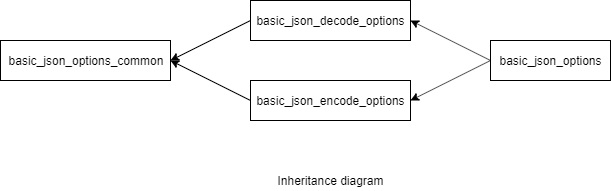

### jsoncons::basic_json_options

```c++
#include <jsoncons/json_options.hpp>

template< 
    class CharT
> class basic_json_options;
```

<br>



Specifies options for reading and writing JSON text. 

Option|Reading|Writing
------|-------|----------
decode_escaped_unicode|Interpret escaped unicode in JSON strings|
nan_to_str|Substitute string with `NaN`, if enabled|Sets a string replacement for `NaN` when writing JSON
inf_to_str|Substitute string with `infinity`, if enabled|Sets a string replacement for infinity when writing JSON
neginf_to_str|Substitute string with `negative infinity`, if enabled|Sets a string replacement for negative infinity when writing JSON
nan_to_num| |Sets a number replacement for `NaN` when writing JSON
inf_to_num| |Sets a number replacement for `Infinity` when writing JSON
neginf_to_num| |Sets a number replacement for `Negative Infinity` when writing JSON
max_nesting_depth|Maximum nesting depth allowed when parsing JSON|Maximum nesting depth allowed when serializing JSON
lossless_number|If `true`, parse numbers with exponents and fractional parts as strings with semantic tagging `semantic_tag::bigdec`. Defaults to `false`.|
indent_size| |The indent size, the default is 4
spaces_around_colon| |Indicates [space option](spaces_option.md) for name separator (`:`). Default is space after.
spaces_around_comma| |Indicates [space option](spaces_option.md) for array value and object name/value pair separators (`,`). Default is space after.
pad_inside_object_braces| |Default is `false`
pad_inside_array_brackets| |Default is `false`
bigint_format| |Overrides [bignum format](bigint_chars_format.md) when serializing json. The default is [bigint_chars_format::base10](bigint_chars_format.md). 
byte_string_format| |Overrides [byte string format](byte_string_chars_format.md) when serializing json. The default is [byte_string_chars_format::base64url](byte_string_chars_format.md). 
float_format| |Overrides [floating point format](../float_chars_format.md) when serializing to JSON. The default is [float_chars_format::general](float_chars_format.md).
precision| |Overrides floating point precision when serializing json. The default is shortest representation.
escape_all_non_ascii| |Escape all non-ascii characters. The default is `false`.
escape_solidus| |Escape the solidus ('/') character. The default is `false`.
new_line_chars| |Defaults to "\n"
line_length_limit| |
object_object_line_splits| |For an object whose parent is an object, set whether that object is split on a new line, or if its members are split on multiple lines. The default is [line_split_kind::multi_line](line_split_kind.md).
array_object_line_splits| |For an object whose parent is an array, set whether that object is split on a new line, or if its members are split on multiple lines. The default is [line_split_kind::multi_line](line_split_kind.md).
object_array_line_splits| |For an array whose parent is an object, set whether that array is split on a new line, or if its elements are split on multiple lines. The default is [line_split_kind::same_line](line_split_kind.md).
array_array_line_splits| |For an array whose parent is an array, set whether that array is split on a new line, or if its elements are split on multiple lines. The default is [line_split_kind::new_line](line_split_kind.md).

The default floating point format is [float_chars_format::general](float_chars_format.md).
The default precision is shortest representation, e.g. 1.1 read will remain `1.1` when written, and not become `1.1000000000000001` (an equivalent but longer representation.)
Trailing zeros are removed, except one immediately following the decimal point. The period character (‘.’) is always used as the decimal point, non English locales are ignored.

Typedefs for common character types are provided:

Type                |Definition
--------------------|------------------------------
`json_options`        |`basic_json_options<char>`
`wjson_options`       |`basic_json_options<wchar_t>`

#### Member constants

    static const uint8_t indent_size_default = 4;
The default size indent is 4

    static const size_t line_length_limit_default = 120;
The default line length limit is 120

Member type                         |Definition
------------------------------------|------------------------------
`char_type`|`CharT`
`string_type`|`std::basic_string<CharT>`

#### Constructors

    basic_json_options()
Constructs a `basic_json_options` with default values. 

    basic_json_options(const basic_json_options& other)
Copy constructor. 

    basic_json_options(basic_json_options&& other)
Move constructor. 

#### Modifiers

    void max_nesting_depth(int depth)
The maximum nesting depth allowed when decoding and encoding JSON. 
Default is 1024. Parsing can have an arbitrarily large depth
limited only by available memory. Serializing a [basic_json](../basic_json.md) to
JSON is limited by stack size.

    basic_json_options& decode_escaped_unicode(bool value); 
Indicates whether to interpret escaped unicode in JSON strings. Defaults to true. 

    basic_json_options& nan_to_str(const string_type& value, bool enable_inverse = true); 
Sets a string replacement for `NaN` when writing JSON, and indicate whether it is also
to be used when reading JSON.

    basic_json_options& inf_to_str(const string_type& value, bool enable_inverse = true); 
Sets a string replacement for infinity when writing JSON, and indicate whether it is also
to be used when reading JSON.

    basic_json_options& neginf_to_str(const string_type& value, bool enable_inverse = true); // (4)
Sets a string replacement for negative infinity when writing JSON, and indicate whether it is also
to be used when reading JSON.

    basic_json_options& nan_to_num(const string_type& value); 
Sets a number replacement for `NaN` when writing JSON

    basic_json_options& inf_to_num(const string_type& value); 
Sets a number replacement for `Infinity` when writing JSON

    basic_json_options& neginf_to_num(const string_type& value); 
Sets a number replacement for `Negative Infinity` when writing JSON

    basic_json_options& lossless_number(bool value); 
If set to `true`, parse numbers with exponents and fractional parts as strings with semantic tagging `semantic_tag::bigdec`.
Defaults to `false`.

    basic_json_options& indent_size(uint8_t value)
The indent size, the default is 4.

    basic_json_options& spaces_around_colon(spaces_option value)
Indicates [space option](spaces_option.md) for name separator (`:`). Default
is space after.

    basic_json_options& spaces_around_comma(spaces_option value)
Indicates [space option](spaces_option.md) for array value and object name/value pair separators (`,`). Default
is space after.

    basic_json_options& pad_inside_object_braces(bool value)
Default is `false`

    basic_json_options& pad_inside_array_brackets(bool value)
Default is `false`

    basic_json_options& bigint_format(bigint_chars_format value)
Overrides [bignum format](bigint_chars_format.md) when serializing json.
The default is [bigint_chars_format::base10](bigint_chars_format.md). 

    basic_json_options& byte_string_format(byte_string_chars_format value)
Overrides [byte string format](byte_string_chars_format.md) when serializing json.
The default is [byte_string_chars_format::base64url](byte_string_chars_format.md). 

    basic_json_options& float_format(float_chars_format value);
Overrides [floating point format](../float_chars_format.md) when serializing to JSON. The default is [float_chars_format::general](float_chars_format.md).

    basic_json_options& precision(int8_t value)
Overrides floating point precision when serializing json. 
The default is shortest representation.

    basic_json_options& escape_all_non_ascii(bool value)
Escape all non-ascii characters. The default is `false`.

    basic_json_options& escape_solidus(bool value)
Escape the solidus ('/') character. The default is `false`.

    basic_json_options& new_line_chars(const string_type& value)
Defaults to "\n"

    basic_json_options& line_length_limit(std::size_t value)

    basic_json_options& object_object_line_splits(line_split_kind value)
For an object whose parent is an object, set whether that object is split on a new line, or if its members are split on multiple lines. The default is [line_split_kind::multi_line](line_split_kind.md).

    basic_json_options& array_object_line_splits(line_split_kind value)
For an object whose parent is an array, set whether that object is split on a new line, or if its members are split on multiple lines. The default is [line_split_kind::multi_line](line_split_kind.md).

    basic_json_options& object_array_line_splits(line_split_kind value)
For an array whose parent is an object, set whether that array is split on a new line, or if its elements are split on multiple lines. The default is [line_split_kind::same_line](line_split_kind.md).

    basic_json_options& array_array_line_splits(line_split_kind value)
For an array whose parent is an array, set whether that array is split on a new line, or if its elements are split on multiple lines. The default is [line_split_kind::new_line](line_split_kind.md).

### Examples

#### Default NaN and inf replacement
```c++
json obj;
obj["field1"] = std::sqrt(-1.0);
obj["field2"] = 1.79e308*1000;
obj["field3"] = -1.79e308*1000;
std::cout << obj << std::endl;
```
Output:
```json
{"field1":null,"field2":null,"field3":null}
```
#### User specified `Nan` and `Inf` replacement

```c++
json obj;
obj["field1"] = std::sqrt(-1.0);
obj["field2"] = 1.79e308*1000;
obj["field3"] = -1.79e308*1000;

json_options options;
format.nan_to_num("null");        // default is "null"
format.inf_to_num("1e9999");  // default is "null"

std::cout << pretty_print(obj,options) << std::endl;
```

Output:
```json
    {
        "field1":null,
        "field2":1e9999,
        "field3":-1e9999
    }
```

#### Decimal precision

By default, jsoncons parses a number with an exponent or fractional part
into a double precision floating point number. If you wish, you can
keep the number as a string with semantic tagging `bigdec`, 
using the `lossless_number` option. You can then put it into a `float`, 
`double`, a boost multiprecision number, or whatever type you want. 

```c++
int main()
{
    std::string s = R"(
    {
        "a" : 12.00,
        "b" : 1.23456789012345678901234567890
    }
    )";

    // Default
    json j = json::parse(s);

    std::cout.precision(15);

    // Access as string
    std::cout << "(1) a: " << j["a"].as<std::string>() << ", b: " << j["b"].as<std::string>() << "\n"; 
    // Access as double
    std::cout << "(2) a: " << j["a"].as<double>() << ", b: " << j["b"].as<double>() << "\n\n"; 

    // Using lossless_number option
    json_options options;
    options.lossless_number(true);

    json j2 = json::parse(s, options);
    // Access as string
    std::cout << "(3) a: " << j2["a"].as<std::string>() << ", b: " << j2["b"].as<std::string>() << "\n";
    // Access as double
    std::cout << "(4) a: " << j2["a"].as<double>() << ", b: " << j2["b"].as<double>() << "\n\n"; 
}
```
Output:
```
(1) a: 12.0, b: 1.2345678901234567
(2) a: 12, b: 1.23456789012346

(3) a: 12.00, b: 1.23456789012345678901234567890
(4) a: 12, b: 1.23456789012346
```

#### Object-array block formatting

```c++
json j;

j["verts"] = json(json_array_arg, {1, 2, 3});
j["normals"] = json(json_array_arg, {1, 0, 1});
j["uvs"] = json(json_array_arg, {0, 0, 1, 1});

std::cout << "Default (same line)" << std::endl;
std::cout << pretty_print(j) << std::endl;

std::cout << "New line" << std::endl;
json_options options1;
format1.object_array_line_splits(line_split_kind::new_line);
std::cout << pretty_print(j,options1) << std::endl;

std::cout << "Multi line" << std::endl;
json_options options2;
format2.object_array_line_splits(line_split_kind::multi_line);
std::cout << pretty_print(j,options2) << std::endl;
```

Output:

Default (same line)

```json
{
    "normals": [1,0,1],
    "uvs": [0,0,1,1],
    "verts": [1,2,3]
}
```

New line

```json
{
    "normals": [
        1,0,1
    ],
    "uvs": [
        0,0,1,1
    ],
    "verts": [
        1,2,3
    ]
}
```
Multi line
```json
{
    "normals": [
        1,
        0,
        1
    ],
    "uvs": [
        0,
        0,
        1,
        1
    ],
    "verts": [
        1,
        2,
        3
    ]
}
```

#### Array-array block formatting

```c++
    json j;
    j["data"]["id"] = json(json_array_arg, {0,1,2,3,4,5,6,7});
    j["data"]["item"] = json(json_array_arg, {json(json_array_arg, {2}),
                                      json(json_array_arg, {4,5,2,3}),
                                      json(json_array_arg, {4}),
                                      json(json_array_arg, {4,5,2,3}),
                                      json(json_array_arg, {2}),
                                      json(json_array_arg, {4,5,3}),
                                      json(json_array_arg, {2}),
                                      json(json_array_arg, {4,3})});

    std::cout << "Default (new line)" << std::endl;
    std::cout << pretty_print(j) << std::endl;

    std::cout << "Same line" << std::endl;
    json_options options1;
    format1.array_array_line_splits(line_split_kind::same_line);
    std::cout << pretty_print(j, options1) << std::endl;

    std::cout << "Multi line" << std::endl;
    json_options options2;
    format2.array_array_line_splits(line_split_kind::multi_line);
    std::cout << pretty_print(j, options2) << std::endl;
```

Output:

Default (new line)

```json
{
    "data": {
        "id": [0,1,2,3,4,5,6,7],
        "item": [
            [2],
            [4,5,2,3],
            [4],
            [4,5,2,3],
            [2],
            [4,5,3],
            [2],
            [4,3]
        ]
    }
}
```
Same line

```json
{
    "data": {
        "id": [0,1,2,3,4,5,6,7],
        "item": [[2],[4,5,2,3],[4],[4,5,2,3],[2],[4,5,3],[2],[4,3]]
    }
}
```

Multi line

```json
{
    "data": {
        "id": [
            0,1,2,3,4,5,6,7
        ],
        "item": [
            [
                2
            ],
            [
                4,
                5,
                2,
                3
            ],
            [
                4
            ],
            [
                4,
                5,
                2,
                3
            ],
            [
                2
            ],
            [
                4,
                5,
                3
            ],
            [
                2
            ],
            [
                4,
                3
            ]
        ]
    }
}
```

