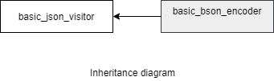

### jsoncons::bson::basic_bson_encoder

```c++
#include <jsoncons_ext/bson/bson_encoder.hpp>

template<
    class Sink>
> class basic_bson_encoder : public jsoncons::json_visitor
```

`basic_bson_encoder` is noncopyable.



Two specializations for common sink types are defined:

Type                       |Definition
---------------------------|------------------------------
bson_stream_encoder        |basic_bson_encoder<jsoncons::binary_stream_sink>
bson_bytes_encoder         |basic_bson_encoder<jsoncons::bytes_sink<std::vector<uint8_t>>>

#### Member types

Type                       |Definition
---------------------------|------------------------------
char_type                  |char
sink_type                  |Sink
string_view_type           |

#### Constructors

    explicit basic_bson_encoder(Sink&& sink)
Constructs a new encoder that writes to the specified destination.

#### Destructor

    virtual ~basic_bson_encoder() noexcept


#### Inherited from [jsoncons::basic_json_visitor](basic_json_visitor.md)

    void flush(); (1)

    bool begin_object(semantic_tag tag=semantic_tag::none,
                      const ser_context& context=ser_context()); (2)

    bool begin_object(std::size_t length, 
                      semantic_tag tag=semantic_tag::none, 
                      const ser_context& context = ser_context()); (3)

    bool end_object(const ser_context& context = ser_context()); (4)

    bool begin_array(semantic_tag tag=semantic_tag::none,
                     const ser_context& context=ser_context()); (5)

    bool begin_array(std::size_t length, 
                     semantic_tag tag=semantic_tag::none,
                     const ser_context& context=ser_context()); (6)

    bool end_array(const ser_context& context=ser_context()); (7)

    bool key(const string_view_type& name, 
              const ser_context& context=ser_context()); (8)

    bool null_value(semantic_tag tag = semantic_tag::none,
                    const ser_context& context=ser_context()); (9) 

    bool bool_value(bool value, 
                    semantic_tag tag = semantic_tag::none,
                    const ser_context& context=ser_context()); (10) 

    bool string_value(const string_view_type& value, 
                      semantic_tag tag = semantic_tag::none, 
                      const ser_context& context=ser_context()); (11) 

    bool byte_string_value(const byte_string_view& source, 
                           semantic_tag tag=semantic_tag::none, 
                           const ser_context& context=ser_context()); (12) (until v0.152.0)

    template <class Source>
    bool byte_string_value(const Source& souce, 
                           semantic_tag tag=semantic_tag::none, 
                           const ser_context& context=ser_context()); (12) (since v0.152.0)

    template <class Source>
    bool byte_string_value(const Source& souce, 
                           uint64_t ext_tag, 
                           const ser_context& context=ser_context()); (13) (since v0.152.0)

    bool uint64_value(uint64_t value, 
                      semantic_tag tag = semantic_tag::none, 
                      const ser_context& context=ser_context()); (14)

    bool int64_value(int64_t value, 
                     semantic_tag tag = semantic_tag::none, 
                     const ser_context& context=ser_context()); (15)

    bool half_value(uint16_t value, 
                    semantic_tag tag = semantic_tag::none, 
                    const ser_context& context=ser_context()); (16)

    bool double_value(double value, 
                      semantic_tag tag = semantic_tag::none, 
                      const ser_context& context=ser_context()); (17)

    bool begin_object(semantic_tag tag,
                      const ser_context& context,
                      std::error_code& ec); (18)

    bool begin_object(std::size_t length, 
                      semantic_tag tag, 
                      const ser_context& context,
                      std::error_code& ec); (19)

    bool end_object(const ser_context& context, 
                    std::error_code& ec); (20)

    bool begin_array(semantic_tag tag, 
                     const ser_context& context, 
                     std::error_code& ec); (21)

    bool begin_array(std::size_t length, 
                     semantic_tag tag, 
                     const ser_context& context, 
                     std::error_code& ec); (22)

    bool end_array(const ser_context& context, 
                   std::error_code& ec); (23)

    bool key(const string_view_type& name, 
              const ser_context& context, 
              std::error_code& ec); (24)

    bool null_value(semantic_tag tag,
                    const ser_context& context,
                    std::error_code& ec); (25) 

    bool bool_value(bool value, 
                    semantic_tag tag,
                    const ser_context& context,
                    std::error_code& ec); (26) 

    bool string_value(const string_view_type& value, 
                      semantic_tag tag, 
                      const ser_context& context,
                      std::error_code& ec); (27) 

    bool byte_string_value(const byte_string_view& source, 
                           semantic_tag tag, 
                           const ser_context& context,
                           std::error_code& ec); (28) (until v0.152.0)

    template <class Source>   
    bool byte_string_value(const Source& source, 
                           semantic_tag tag, 
                           const ser_context& context,
                           std::error_code& ec); (28) (since v0.152.0)

    template <class Source>   
    bool byte_string_value(const Source& source, 
                           uint64_t ext_tag, 
                           const ser_context& context,
                           std::error_code& ec); (29) (since v0.152.0)

    bool uint64_value(uint64_t value, 
                      semantic_tag tag, 
                      const ser_context& context,
                      std::error_code& ec); (30)

    bool int64_value(int64_t value, 
                     semantic_tag tag, 
                     const ser_context& context,
                     std::error_code& ec); (31)

    bool half_value(uint16_t value, 
                    semantic_tag tag, 
                    const ser_context& context,
                    std::error_code& ec); (32)

    bool double_value(double value, 
                      semantic_tag tag, 
                      const ser_context& context,
                      std::error_code& ec); (33)

    template <class T>
    bool typed_array(const span<T>& data, 
                     semantic_tag tag=semantic_tag::none,
                     const ser_context& context=ser_context()); (34)

    bool typed_array(half_arg_t, const span<const uint16_t>& s,
        semantic_tag tag = semantic_tag::none,
        const ser_context& context = ser_context()); (35)

    bool begin_multi_dim(const span<const size_t>& shape,
                         semantic_tag tag,
                         const ser_context& context); (36) 

    bool end_multi_dim(const ser_context& context=ser_context()); (37) 

    template <class T>
    bool typed_array(const span<T>& data, 
                     semantic_tag tag,
                     const ser_context& context,
                     std::error_code& ec); (38)

    bool typed_array(half_arg_t, const span<const uint16_t>& s,
                     semantic_tag tag,
                     const ser_context& context,
                     std::error_code& ec); (39)

    bool begin_multi_dim(const span<const size_t>& shape,
                         semantic_tag tag,
                         const ser_context& context, 
                         std::error_code& ec); (40)

    bool end_multi_dim(const ser_context& context,
                       std::error_code& ec); (41) 

(1) Flushes whatever is buffered to the destination.

(2) Indicates the begining of an object of indefinite length.
Returns `true` if the consumer wishes to receive more events, `false` otherwise.
Throws a [ser_error](ser_error.md) on parse errors. 

(3) Indicates the begining of an object of known length. 
Returns `true` if the consumer wishes to receive more events, `false` otherwise.
Throws a [ser_error](ser_error.md) on parse errors. 

(4) Indicates the end of an object.
Returns `true` if the consumer wishes to receive more events, `false` otherwise.
Throws a [ser_error](ser_error.md) on parse errors. 

(5) Indicates the beginning of an indefinite length array. 
Returns `true` if the consumer wishes to receive more events, `false` otherwise.
Throws a [ser_error](ser_error.md) on parse errors. 

(6) Indicates the beginning of an array of known length. 
Returns `true` if the consumer wishes to receive more events, `false` otherwise.
Throws a [ser_error](ser_error.md) on parse errors. 

(7) Indicates the end of an array.
Returns `true` if the consumer wishes to receive more events, `false` otherwise.
Throws a [ser_error](ser_error.md) on parse errors. 

(8) Writes the name part of an object name-value pair.
Returns `true` if the consumer wishes to receive more events, `false` otherwise.
Throws a [ser_error](ser_error.md) on parse errors. 

(9) Writes a null value. 
Returns `true` if the consumer wishes to receive more events, `false` otherwise.
Throws a [ser_error](ser_error.md) on parse errors. 

(10) Writes a boolean value.
Returns `true` if the consumer wishes to receive more events, `false` otherwise.
Throws a [ser_error](ser_error.md) on parse errors. 

(11) Writes a text string value.
Returns `true` if the consumer wishes to receive more events, `false` otherwise.
Throws a [ser_error](ser_error.md) on parse errors. 

(12) Writes a byte string value `source` with a generic tag.
Type `Source` must be a container that has member functions `data()` and `size()`, 
and member type `value_type` with size exactly 8 bits (since v0.152.0.)
Returns `true` if the consumer wishes to receive more events, `false` otherwise.
Throws a [ser_error](ser_error.md) on parse errors. 

(13) Writes a byte string value `source` with a format specific tag, `ext_tag`.
Type `Source` must be a container that has member functions `data()` and `size()`, 
and member type `value_type` with size exactly 8 bits (since v0.152.0.)
Returns `true` if the consumer wishes to receive more events, `false` otherwise.
Throws a [ser_error](ser_error.md) on parse errors. 

(14) Writes a non-negative integer value.
Returns `true` if the consumer wishes to receive more events, `false` otherwise.
Throws a [ser_error](ser_error.md) on parse errors. 

(15) Writes a signed integer value.
Returns `true` if the consumer wishes to receive more events, `false` otherwise.
Throws a [ser_error](ser_error.md) on parse errors. 

(16) Writes a half precision floating point value.
Returns `true` if the consumer wishes to receive more events, `false` otherwise.
Throws a [ser_error](ser_error.md) on parse errors. 

(17) Writes a double precision floating point value.
Returns `true` if the consumer wishes to receive more events, `false` otherwise.
Throws a [ser_error](ser_error.md) on parse errors. 

(18)-(33) Same as (2)-(17), except sets `ec` and returns `false` on parse errors.

### Examples

#### Encode to BSON

```c++
#include <jsoncons/json.hpp>
#include <jsoncons_ext/bson/bson.hpp>
#include <iomanip>

int main()
{
    std::vector<uint8_t> buffer;
    bson::bson_bytes_encoder encoder(buffer);
    encoder.begin_array(); // The total number of bytes comprising 
                          // the bson document will be calculated
    encoder.string_value("cat");
    std::vector<uint8_t> purr = {'p','u','r','r'};
    encoder.byte_string_value(purr, 7);
    encoder.int64_value(1431027667, semantic_tag::epoch_second);
    encoder.end_array();
    encoder.flush();

    std::cout << byte_string_view(buffer) << "\n\n";

/* 
    23000000 -- Total number of bytes comprising the document (35 bytes) 
      02 -- UTF-8 string
        3000 -- "0"
        04000000 -- number bytes in the string (including trailing byte)
          636174  -- "cat"
            00 -- trailing byte
      05 -- binary
        3100 -- "1"
        04000000 -- number of bytes
        07 -- subtype
        70757272 -- 'P','u','r','r'
      09 -- datetime
      3200 -- "2"
        d3bf4b55 -- 1431027667
      00 
*/ 
}
```
Output:
```
23,00,00,00,02,30,00,04,00,00,00,63,61,74,00,05,31,00,04,00,00,00,07,70,75,72,72,09,32,00,d3,bf,4b,55,00
```

### See also

[byte_string_view](../byte_string_view.md)
