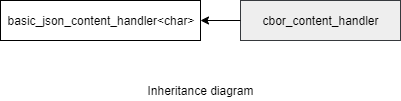

### jsoncons::cbor::basic_cbor_content_handler

```c++
#include <jsoncons_ext/cbor/cbor_content_handler.hpp>

template <
    class Float128T
> class basic_cbor_content_handler : public basic_json_content_handler<char>
```

Defines an interface for producing and consuming CBOR events, including [typed arrays](https://tools.ietf.org/html/draft-ietf-cbor-array-tags-08). 

`basic_cbor_content_handler` is noncopyable and nonmoveable.



A typedef is provided for content handlers using only standard C++ floating point types.

Type                |Definition
--------------------|------------------------------
cbor_content_handler    |`basic_cbor_content_handler<std::nullptr>`

#### Member types

Member type                         |Definition
------------------------------------|------------------------------
`char_type`|char
`float128_type`|Float128T
`string_view_type`|A non-owning view of a string, holds a pointer to character data and length. Supports conversion to and from strings. Will be typedefed to the C++ 17 [std::string view](http://en.cppreference.com/w/cpp/string/basic_string_view) if C++ 17 is detected or if `JSONCONS_HAS_STRING_VIEW` is defined, otherwise proxied.  

#### Public event producer interface

    bool typed_array(const span<const uint8_t>& data, 
                     semantic_tag tag=semantic_tag::none,
                     const ser_context& context=null_ser_context())

    bool typed_array(const span<const uint16_t>& data, 
                     semantic_tag tag=semantic_tag::none,
                     const ser_context& context=null_ser_context())

    bool typed_array(const span<const uint32_t>& data, 
                     semantic_tag tag=semantic_tag::none,
                     const ser_context& context=null_ser_context())

    bool typed_array(const span<const uint64_t>& data, 
                     semantic_tag tag=semantic_tag::none,
                     const ser_context& context=null_ser_context())

    bool typed_array(const span<const int8_t>& data, 
                     semantic_tag tag=semantic_tag::none,
                     const ser_context& context=null_ser_context())

    bool typed_array(const span<const int16_t>& data, 
                     semantic_tag tag=semantic_tag::none,
                     const ser_context& context=null_ser_context())

    bool typed_array(const span<const int32_t>& data, 
                     semantic_tag tag=semantic_tag::none,
                     const ser_context& context=null_ser_context())

    bool typed_array(const span<const int64_t>& data, 
                     semantic_tag tag=semantic_tag::none,
                     const ser_context& context=null_ser_context())

    bool typed_array(half_arg_t, const span<const uint16_t>& data,
                     semantic_tag tag = semantic_tag::none,
                     const ser_context& context = null_ser_context())

    bool typed_array(const span<const float>& data, 
                     semantic_tag tag=semantic_tag::none,
                     const ser_context& context=null_ser_context())

    bool typed_array(const span<const double>& data, 
                     semantic_tag tag=semantic_tag::none,
                     const ser_context& context=null_ser_context())

    bool typed_array(const span<const float128_type>& data, 
                     semantic_tag tag=semantic_tag::none,
                     const ser_context& context=null_ser_context())

    bool begin_multi_dim(const span<const size_t>& shape,
                         semantic_tag tag,
                         const ser_context& context) 

    bool end_multi_dim(const ser_context& context=null_ser_context()) 

    bool typed_array(const span<const uint8_t>& v, 
                     semantic_tag tag,
                     const ser_context& context, 
                     std::error_code& ec)

    bool typed_array(const span<const uint16_t>& data, 
                     semantic_tag tag,
                     const ser_context& context, 
                     std::error_code& ec)

    bool typed_array(const span<const uint32_t>& data, 
                     semantic_tag tag,
                     const ser_context& context, 
                     std::error_code& ec)

    bool typed_array(const span<const uint64_t>& data, 
                     semantic_tag tag,
                     const ser_context& context, 
                     std::error_code& ec)

    bool typed_array(const span<const int8_t>& data, 
                     semantic_tag tag,
                     const ser_context& context, 
                     std::error_code& ec)

    bool typed_array(const span<const int16_t>& data, 
                     semantic_tag tag,
                     const ser_context& context, 
                     std::error_code& ec)

    bool typed_array(const span<const int32_t>& data, 
                     semantic_tag tag,
                     const ser_context& context, 
                     std::error_code& ec)

    bool typed_array(const span<const int64_t>& data, 
                     semantic_tag tag,
                     const ser_context& context, 
                     std::error_code& ec)

    bool typed_array(half_arg_t arg, const span<const uint16_t>& data, 
                     semantic_tag tag,
                     const ser_context& context, 
                     std::error_code& ec)

    bool typed_array(const span<const float>& data, 
                     semantic_tag tag,
                     const ser_context& context, 
                     std::error_code& ec)

    bool typed_array(const span<const double>& data, 
                     semantic_tag tag,
                     const ser_context& context, 
                     std::error_code& ec)

    bool begin_multi_dim(const span<const size_t>& shape,
                         semantic_tag tag,
                         const ser_context& context, 
                         std::error_code& ec) 

    bool end_multi_dim(const ser_context& context,
                       std::error_code& ec) 

#### Private event consumer interface

    virtual bool do_typed_array(const span<const uint8_t>& data, 
                                semantic_tag tag,
                                const ser_context& context, 
                                std::error_code& ec) = 0;

    virtual bool do_typed_array(const span<const uint16_t>& data, 
                                semantic_tag tag,
                                const ser_context& context, 
                                std::error_code& ec) = 0;

    virtual bool do_typed_array(const span<const uint32_t>& data, 
                                semantic_tag tag,
                                const ser_context& context, 
                                std::error_code& ec) = 0;

    virtual bool do_typed_array(const span<const uint64_t>& data, 
                                semantic_tag tag,
                                const ser_context& context, 
                                std::error_code& ec) = 0;

    virtual bool do_typed_array(const span<const int8_t>& data, 
                                semantic_tag tag,
                                const ser_context& context, 
                                std::error_code& ec) = 0;

    virtual bool do_typed_array(const span<const int16_t>& data, 
                                semantic_tag tag,
                                const ser_context& context, 
                                std::error_code& ec) = 0;

    virtual bool do_typed_array(const span<const int32_t>& data, 
                                semantic_tag tag,
                                const ser_context& context, 
                                std::error_code& ec) = 0;

    virtual bool do_typed_array(const span<const int64_t>& data, 
                                semantic_tag tag,
                                const ser_context& context, 
                                std::error_code& ec) = 0;

    virtual bool do_typed_array(half_arg_t, 
                                const span<const uint16_t>& data, 
                                semantic_tag tag,
                                const ser_context& context, 
                                std::error_code& ec) = 0;

    virtual bool do_typed_array(const span<const float>& data, 
                                semantic_tag tag,
                                const ser_context& context, 
                                std::error_code& ec) = 0;

    virtual bool do_typed_array(const span<const double>& data, 
                                semantic_tag tag,
                                const ser_context& context, 
                                std::error_code& ec) = 0;

    virtual bool do_typed_array(const span<const float128_type>& data, 
                                semantic_tag tag,
                                const ser_context& context, 
                                std::error_code& ec) = 0;

    virtual bool do_begin_multi_dim(const span<const size_t>& shape,
                                    semantic_tag tag,
                                    const ser_context& context, 
                                    std::error_code& ec) = 0;

    virtual bool do_end_multi_dim(const ser_context& context,
                                  std::error_code& ec) = 0;

### See also

- [basic_default_cbor_content_handler](basic_default_cbor_content_handler.md)

- [basic_json_content_handler](../basic_json_content_handler.md)

### Examples


