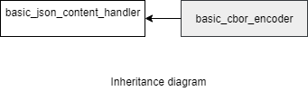

### jsoncons::cbor::basic_cbor_encoder

```c++
#include <jsoncons_ext/cbor/cbor_encoder.hpp>

template<
    class Result,class Float128T = std::nullptr_t>
> class basic_cbor_encoder final : public basic_cbor_content_handler<Float128T>
```

`basic_cbor_encoder` is noncopyable



Four specializations for common result types are defined:

Type                       |Definition
---------------------------|------------------------------
cbor_stream_encoder            |basic_cbor_encoder<jsoncons::binary_stream_result>
cbor_bytes_encoder     |basic_cbor_encoder<jsoncons::binary_buffer_result>

#### Member types

Type                       |Definition
---------------------------|------------------------------
char_type                  |char
result_type                |Result
float128_type              |Float128T
string_view_type           |

#### Constructors

    explicit basic_cbor_encoder(result_type result)
Constructs a new encoder that writes to the specified result.

#### Destructor

    virtual ~basic_cbor_encoder()


#### Inherited from [jsoncons::cbor::basic_cbor_content_handler](basic_cbor_content_handler.md)

    bool typed_array(const span<const uint8_t>& data, 
                     semantic_tag tag=semantic_tag::none,
                     const ser_context& context=null_ser_context())

    bool typed_array(const span<const uint16_t>& data, 
                     semantic_tag tag=semantic_tag::none,
                     const ser_context& context=null_ser_context())

    bool typed_array(const span<const uint32_t>& data, 
                     semantic_tag tag=semantic_tag::none,
                     const ser_context& context=null_ser_context())

    bool typed_array(const span<const uint64_t>& data, 
                     semantic_tag tag=semantic_tag::none,
                     const ser_context& context=null_ser_context())

    bool typed_array(const span<const int8_t>& data, 
                     semantic_tag tag=semantic_tag::none,
                     const ser_context& context=null_ser_context())

    bool typed_array(const span<const int16_t>& data, 
                     semantic_tag tag=semantic_tag::none,
                     const ser_context& context=null_ser_context())

    bool typed_array(const span<const int32_t>& data, 
                     semantic_tag tag=semantic_tag::none,
                     const ser_context& context=null_ser_context())

    bool typed_array(const span<const int64_t>& data, 
                     semantic_tag tag=semantic_tag::none,
                     const ser_context& context=null_ser_context())

    bool typed_array(half_arg_t, const span<const uint16_t>& data,
                     semantic_tag tag = semantic_tag::none,
                     const ser_context& context = null_ser_context())

    bool typed_array(const span<const float>& data, 
                     semantic_tag tag=semantic_tag::none,
                     const ser_context& context=null_ser_context())

    bool typed_array(const span<const double>& data, 
                     semantic_tag tag=semantic_tag::none,
                     const ser_context& context=null_ser_context())

    bool typed_array(const span<const float128_type>& data, 
                     semantic_tag tag=semantic_tag::none,
                     const ser_context& context=null_ser_context())

    bool begin_multi_dim(const span<const size_t>& shape,
                         semantic_tag tag,
                         const ser_context& context) 

    bool end_multi_dim(const ser_context& context=null_ser_context()) 

    bool typed_array(const span<const uint8_t>& v, 
                     semantic_tag tag,
                     const ser_context& context, 
                     std::error_code& ec)

    bool typed_array(const span<const uint16_t>& data, 
                     semantic_tag tag,
                     const ser_context& context, 
                     std::error_code& ec)

    bool typed_array(const span<const uint32_t>& data, 
                     semantic_tag tag,
                     const ser_context& context, 
                     std::error_code& ec)

    bool typed_array(const span<const uint64_t>& data, 
                     semantic_tag tag,
                     const ser_context& context, 
                     std::error_code& ec)

    bool typed_array(const span<const int8_t>& data, 
                     semantic_tag tag,
                     const ser_context& context, 
                     std::error_code& ec)

    bool typed_array(const span<const int16_t>& data, 
                     semantic_tag tag,
                     const ser_context& context, 
                     std::error_code& ec)

    bool typed_array(const span<const int32_t>& data, 
                     semantic_tag tag,
                     const ser_context& context, 
                     std::error_code& ec)

    bool typed_array(const span<const int64_t>& data, 
                     semantic_tag tag,
                     const ser_context& context, 
                     std::error_code& ec)

    bool typed_array(half_arg_t arg, const span<const uint16_t>& data, 
                     semantic_tag tag,
                     const ser_context& context, 
                     std::error_code& ec)

    bool typed_array(const span<const float>& data, 
                     semantic_tag tag,
                     const ser_context& context, 
                     std::error_code& ec)

    bool typed_array(const span<const double>& data, 
                     semantic_tag tag,
                     const ser_context& context, 
                     std::error_code& ec)

    bool begin_multi_dim(const span<const size_t>& shape,
                         semantic_tag tag,
                         const ser_context& context, 
                         std::error_code& ec) 

    bool end_multi_dim(const ser_context& context,
                       std::error_code& ec) 

#### Inherited from [jsoncons::basic_json_content_handler](basic_json_content_handler.md)

    bool begin_object(semantic_tag tag=semantic_tag::none,
                      const ser_context& context=null_ser_context()); // (1)

    bool begin_object(size_t length, 
                      semantic_tag tag=semantic_tag::none, 
                      const ser_context& context = null_ser_context()); // (2)

    bool end_object(const ser_context& context = null_ser_context()); // (3)

    bool begin_array(semantic_tag tag=semantic_tag::none,
                     const ser_context& context=null_ser_context()); // (4)

    bool begin_array(size_t length, 
                     semantic_tag tag=semantic_tag::none,
                     const ser_context& context=null_ser_context()); // (5)

    bool end_array(const ser_context& context=null_ser_context()); // (6)

    bool name(const string_view_type& name, 
              const ser_context& context=null_ser_context()); // (7)

    bool null_value(semantic_tag tag = semantic_tag::none,
                    const ser_context& context=null_ser_context()); // (8) 

    bool bool_value(bool value, 
                    semantic_tag tag = semantic_tag::none,
                    const ser_context& context=null_ser_context()); // (9) 

    bool string_value(const string_view_type& value, 
                      semantic_tag tag = semantic_tag::none, 
                      const ser_context& context=null_ser_context()); // (10) 

    bool byte_string_value(const byte_string_view& b, 
                           semantic_tag tag=semantic_tag::none, 
                           const ser_context& context=null_ser_context()); // (11)

    bool uint64_value(uint64_t value, 
                      semantic_tag tag = semantic_tag::none, 
                      const ser_context& context=null_ser_context()); // (12)

    bool int64_value(int64_t value, 
                     semantic_tag tag = semantic_tag::none, 
                     const ser_context& context=null_ser_context()); // (13)

    bool half_value(uint16_t value, 
                    semantic_tag tag = semantic_tag::none, 
                    const ser_context& context=null_ser_context()); // (14)

    bool double_value(double value, 
                      semantic_tag tag = semantic_tag::none, 
                      const ser_context& context=null_ser_context()); // (15)

    bool begin_object(semantic_tag tag,
                      const ser_context& context,
                      std::error_code& ec); // (16)

    bool begin_object(size_t length, 
                      semantic_tag tag, 
                      const ser_context& context,
                      std::error_code& ec); // (17)

    bool end_object(const ser_context& context, 
                    std::error_code& ec); // (18)

    bool begin_array(semantic_tag tag, 
                     const ser_context& context, 
                     std::error_code& ec); // (19)

    bool begin_array(size_t length, 
                     semantic_tag tag, 
                     const ser_context& context, 
                     std::error_code& ec); // (20)

    bool end_array(const ser_context& context, 
                   std::error_code& ec); // (21)

    bool name(const string_view_type& name, 
              const ser_context& context, 
              std::error_code& ec); // (22)

    bool null_value(semantic_tag tag,
                    const ser_context& context,
                    std::error_code& ec); // (23) 

    bool bool_value(bool value, 
                    semantic_tag tag,
                    const ser_context& context,
                    std::error_code& ec); // (24) 

    bool string_value(const string_view_type& value, 
                      semantic_tag tag, 
                      const ser_context& context,
                      std::error_code& ec); // (25) 

    bool byte_string_value(const byte_string_view& b, 
                           semantic_tag tag, 
                           const ser_context& context,
                           std::error_code& ec); // (26)

    bool uint64_value(uint64_t value, 
                      semantic_tag tag, 
                      const ser_context& context,
                      std::error_code& ec); // (27)

    bool int64_value(int64_t value, 
                     semantic_tag tag, 
                     const ser_context& context,
                     std::error_code& ec); // (28)

    bool half_value(uint16_t value, 
                    semantic_tag tag, 
                    const ser_context& context,
                    std::error_code& ec); // (29)

    bool double_value(double value, 
                      semantic_tag tag, 
                      const ser_context& context,
                      std::error_code& ec); // (30)

(1) Indicates the begining of an object of indefinite length.
Returns `true` if the consumer wishes to receive more events, `false` otherwise.
Throws a [ser_error](ser_error.md) on parse errors. 

(2) Indicates the begining of an object of known length. 
Returns `true` if the consumer wishes to receive more events, `false` otherwise.
Throws a [ser_error](ser_error.md) on parse errors. 

(3) Indicates the end of an object.
Returns `true` if the consumer wishes to receive more events, `false` otherwise.
Throws a [ser_error](ser_error.md) on parse errors. 

(4) Indicates the beginning of an indefinite length array. 
Returns `true` if the consumer wishes to receive more events, `false` otherwise.
Throws a [ser_error](ser_error.md) on parse errors. 

(5) Indicates the beginning of an array of known length. 
Returns `true` if the consumer wishes to receive more events, `false` otherwise.
Throws a [ser_error](ser_error.md) on parse errors. 

(6) Indicates the end of an array.
Returns `true` if the consumer wishes to receive more events, `false` otherwise.
Throws a [ser_error](ser_error.md) on parse errors. 

(7) Writes the name part of an object name-value pair.
Returns `true` if the consumer wishes to receive more events, `false` otherwise.
Throws a [ser_error](ser_error.md) on parse errors. 

(8) Writes a null value. 
Returns `true` if the consumer wishes to receive more events, `false` otherwise.
Throws a [ser_error](ser_error.md) on parse errors. 

(9) Writes a boolean value.
Returns `true` if the consumer wishes to receive more events, `false` otherwise.
Throws a [ser_error](ser_error.md) on parse errors. 

(10) Writes a text string value.
Returns `true` if the consumer wishes to receive more events, `false` otherwise.
Throws a [ser_error](ser_error.md) on parse errors. 

(11) Writes a byte string value.
Returns `true` if the consumer wishes to receive more events, `false` otherwise.
Throws a [ser_error](ser_error.md) on parse errors. 

(12) Writes a non-negative integer value.
Returns `true` if the consumer wishes to receive more events, `false` otherwise.
Throws a [ser_error](ser_error.md) on parse errors. 

(13) Writes a signed integer value.
Returns `true` if the consumer wishes to receive more events, `false` otherwise.
Throws a [ser_error](ser_error.md) on parse errors. 

(14) Writes a half precision floating point value.
Returns `true` if the consumer wishes to receive more events, `false` otherwise.
Throws a [ser_error](ser_error.md) on parse errors. 

(15) Writes a double precision floating point value.
Returns `true` if the consumer wishes to receive more events, `false` otherwise.
Throws a [ser_error](ser_error.md) on parse errors. 

(16)-(30) Same as (1)-(15), except sets `ec` and returns `false` on parse errors.

    void flush()
Flushes whatever is buffered to the destination.

### Examples

#### Encode to CBOR buffer

```c++
#include <jsoncons/json.hpp>
#include <jsoncons_ext/cbor/cbor.hpp>
#include <iomanip>

int main()
{
    std::vector<uint8_t> buffer;
    cbor::cbor_bytes_encoder encoder(buffer);

    encoder.begin_array(); // Indefinite length array
    encoder.string_value("cat");
    encoder.byte_string_value(byte_string({'p','u','r','r'}));
    encoder.byte_string_value(byte_string({'h','i','s','s'}),
                             semantic_tag::base64); // suggested conversion to base64
    encoder.int64_value(1431027667, semantic_tag::timestamp);
    encoder.end_array();
    encoder.flush();

    for (auto c : buffer)
    {
        std::cout << std::hex << std::setprecision(2) << std::setw(2) 
                  << std::noshowbase << std::setfill('0') << static_cast<int>(c);
    }
    std::cout << "\n\n";

/* 
    9f -- Start indefinte length array
      63 -- String value of length 3
        636174 -- "cat"
      44 -- Byte string value of length 4
        70757272 -- 'p''u''r''r'
      d6 - Expected conversion to base64
      44
        68697373 -- 'h''i''s''s'
      c1 -- Tag value 1 (seconds relative to 1970-01-01T00:00Z in UTC time)
        1a -- 32 bit unsigned integer
          554bbfd3 -- 1431027667
      ff -- "break" 
*/ 
}
```
Output:
```
9f636361744470757272d64468697373c11a554bbfd3ff
```

#### Encode to CBOR stream

```c++

#include <jsoncons/json.hpp>
#include <jsoncons_ext/cbor/cbor.hpp>
#include <iomanip>

int main()
{
    std::ostringstream os;
    cbor::cbor_stream_encoder encoder(os);

    encoder.begin_array(3); // array of length 3
    encoder.string_value("-18446744073709551617", semantic_tag::bigint);
    encoder.string_value("184467440737095516.16", semantic_tag::bigdec);
    encoder.int64_value(1431027667, semantic_tag::timestamp);
    encoder.end_array();
    encoder.flush();

    for (auto c : os.str())
    {
        std::cout << std::hex << std::setprecision(2) << std::setw(2) 
                  << std::noshowbase << std::setfill('0') << (int)unsigned char(c);
    }
    std::cout << "\n\n";

/*
    83 -- array of length 3
      c3 -- Tag 3 (negative bignum)
      49 -- Byte string value of length 9
        010000000000000000 -- Bytes content
      c4 -- Tag 4 (decimal fraction)
        82 -- Array of length 2
          21 -- -2 (exponent)
          c2 Tag 2 (positive bignum)
          49 -- Byte string value of length 9
            010000000000000000
      c1 -- Tag 1 (seconds relative to 1970-01-01T00:00Z in UTC time)
        1a -- 32 bit unsigned integer
          554bbfd3 -- 1431027667
*/
}
```
Output:
```
83c349010000000000000000c48221c249010000000000000000c11a554bbfd3
```

#### Encode Typed Array tags - array of half precision floating-point

```c++
#include <jsoncons/json.hpp>
#include <jsoncons_ext/cbor/cbor.hpp>
#include <iomanip>

int main()
{
    std::vector<uint8_t> buffer;

    cbor::cbor_options options;
    options.enable_typed_arrays(true);
    cbor::cbor_bytes_encoder encoder(buffer, options);

    std::vector<uint16_t> values = {0x3bff,0x3c00,0x3c01,0x3555};
    encoder.typed_array(half_arg, values);

    // buffer contains a half precision floating-point, native endian, Typed Array 
    std::cout << "(1)\n" << byte_string_view(buffer.data(), buffer.size()) << "\n\n";

    auto j = cbor::decode_cbor<json>(buffer);

    std::cout << "(2)\n";
    for (auto item : j.array_range())
    {
        std::cout << std::boolalpha << item.is_half() 
                  << " " << std::hex << (int)item.as<uint16_t>() 
                  << " " << std::defaultfloat << item.as<double>() << "\n";
    }
    std::cout << "\n";

    std::cout << "(3)\n" << pretty_print(j) << "\n\n";
}
```
Output
```
(1)
d8 54 48 ff 3b 00 3c 01 3c 55 35

(2)
true 3bff 0.999512
true 3c00 1
true 3c01 1.00098
true 3555 0.333252

(3)
[
    0.99951171875,
    1.0,
    1.0009765625,
    0.333251953125
]
```

#### Encode Typed Array tags - multi-dimensional column major tag 

```c++
#include <jsoncons/json.hpp>
#include <jsoncons_ext/cbor/cbor.hpp>

int main()
{
    std::vector<uint8_t> v;

    cbor::cbor_bytes_encoder encoder(v);
    std::vector<size_t> shape = { 2,3 };
    encoder.begin_multi_dim(shape, semantic_tag::multi_dim_column_major);
    encoder.begin_array(6);
    encoder.uint64_value(2);
    encoder.uint64_value(4);
    encoder.uint64_value(8);
    encoder.uint64_value(4);
    encoder.uint64_value(16);
    encoder.uint64_value(256);
    encoder.end_array();
    encoder.end_multi_dim();

    std::cout << "(1)\n" << byte_string_view(v.data(), v.size()) << "\n\n";

    auto j = cbor::decode_cbor<json>(v);
    std::cout << "(2) " << j.tag() << "\n";
    std::cout << pretty_print(j) << "\n\n";
}
```
Output:
```
(1)
d9 04 10 82 82 02 03 86 02 04 08 04 10 19 01 00

(2) multi-dim-column-major
[
    [2, 3],
    [2, 4, 8, 4, 16, 256]
]
```

