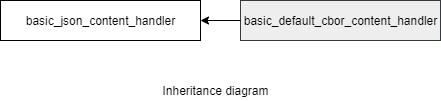

### jsoncons::basic_default_cbor_content_handler

```c++
#include <jsoncons_ext/cbor/cbor_content_handler.hpp>

template <
    class Float128T
> class basic_default_cbor_content_handler
```

A [basic_cbor_content_handler](basic_cbor_content_handler.md) that discards all incoming cbor events. Serves as a base class for user defined content handlers.
`basic_default_cbor_content_handler` is noncopyable and nonmoveable.



A typedef is provided for content handlers using only standard C++ floating point types.

Type                |Definition
--------------------|------------------------------
default_cbor_content_handler    |`basic_default_cbor_content_handler<nullptr>`

#### Member types

Member type                         |Definition
------------------------------------|------------------------------
`char_type`|char
`string_view_type`|A non-owning view of a string, holds a pointer to character data and length. Supports conversion to and from strings. Will be typedefed to the C++ 17 [std::string view](http://en.cppreference.com/w/cpp/string/basic_string_view) if C++ 17 is detected or if `JSONCONS_HAS_STRING_VIEW` is defined, otherwise proxied.  

#### Constructors

    basic_default_cbor_content_handler(bool accept_more = true)

Constructs a `basic_default_cbor_content_handler`. The parameter
`accept_more` indicates whether the content handler will, after
consuming an event, accept more events.


