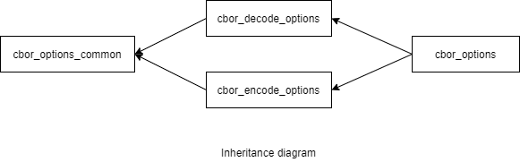

### jsoncons::cbor::cbor_options

```c++
#include <jsoncons_ext/cbor/cbor_options.hpp>

class cbor_options;
```

<br>



Specifies options for reading and writing CBOR.

#### Constructors

    cbor_options()
Constructs a `cbor_options` with default values. 

#### Modifiers

    void max_nesting_depth(int depth)
The maximum nesting depth allowed when decoding and encoding CBOR. 
Default is 1024. Parsing can have an arbitrarily large depth
limited only by available memory. Serializing a [basic_json](../basic_json.md) to
CBOR is limited by stack size.

    cbor_options& pack_strings(bool value)

If set to `true`, then encode will store text strings and
byte strings once, and use string references to represent repeated occurences
of the strings. Decoding the resulting CBOR requires a decoder
that supports the 
[stringref extension to CBOR](http://cbor.schmorp.de/stringref), such as
jsoncons itself, or [Perl CBOR::XS](http://software.schmorp.de/pkg/CBOR-XS.html)

If set to `false` (the default), then encode
will encode strings the usual CBOR way. 

This option does not affect decode - jsoncons will always decode
string references if present.

    cbor_options& use_typed_arrays(bool value)

This option does not affect decode - jsoncons will always decode
typed arrays if present.


