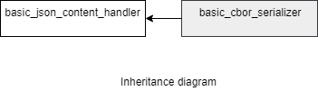

### jsoncons::cbor::basic_cbor_serializer

```c++
template<
    class CharT,
    class Result>
> class basic_cbor_serializer : public jsoncons::basic_json_content_handler<CharT>
```

`basic_cbor_serializer` is noncopyable and nonmoveable.

#### Header

    #include <jsoncons_ext/cbor/cbor_serializer.hpp>



Four specializations for common character types and result types are defined:

Type                       |Definition
---------------------------|------------------------------
cbor_serializer            |basic_cbor_serializer<char,jsoncons::binary_stream_result>
cbor_buffer_serializer     |basic_cbor_serializer<char,jsoncons::binary_buffer_result>
wcbor_serializer           |basic_cbor_serializer<wchar_t,jsoncons::binary_stream_result>
wcbor_buffer_serializer    |basic_cbor_serializer<wchar_t,jsoncons::binary_buffer_result>

#### Member types

Type                       |Definition
---------------------------|------------------------------
char_type                  |CharT
result_type                |Result
string_view_type           |

#### Constructors

    explicit basic_cbor_serializer(result_type result)
Constructs a new serializer that writes to the specified result.

#### Destructor

    virtual ~basic_cbor_serializer()

### Inherited from [basic_json_content_handler](../json_content_handler.md)

#### Member functions

    bool begin_object(semantic_tag_type tag=semantic_tag_type::none,
                      const serializing_context& context=null_serializing_context()); 

    bool begin_object(size_t length, 
                      semantic_tag_type tag=semantic_tag_type::none,
                      const serializing_context& context=null_serializing_context()); 

    bool end_object(const serializing_context& context = null_serializing_context())

    bool begin_array(semantic_tag_type tag=semantic_tag_type::none,
                     const serializing_context& context=null_serializing_context()); 

    bool begin_array(semantic_tag_type tag=semantic_tag_type::none,
                     const serializing_context& context=null_serializing_context()); 

    bool end_array(const serializing_context& context=null_serializing_context()); 

    bool name(const string_view_type& name, 
              const serializing_context& context=null_serializing_context()); 

    bool string_value(const string_view_type& value, 
                      semantic_tag_type tag = semantic_tag_type::none, 
                      const serializing_context& context=null_serializing_context()); ;

    bool byte_string_value(const byte_string_view& b, 
                           semantic_tag_type tag=semantic_tag_type::none, 
                           const serializing_context& context=null_serializing_context()); 

    bool byte_string_value(const uint8_t* p, size_t size, 
                           semantic_tag_type tag=semantic_tag_type::none, 
                           const serializing_context& context=null_serializing_context()); 

    bool big_integer_value(const string_view_type& s, 
                           const serializing_context& context=null_serializing_context());  

    bool big_decimal_value(const string_view_type& s, 
                           const serializing_context& context=null_serializing_context());  

    bool date_time_value(const string_view_type& s, 
                         const serializing_context& context=null_serializing_context());  

    bool timestamp_value(int64_t val, 
                         const serializing_context& context=null_serializing_context());  

    bool int64_value(int64_t value, 
                     semantic_tag_type tag = semantic_tag_type::none, 
                     const serializing_context& context=null_serializing_context()); ;

    bool uint64_value(uint64_t value, 
                      semantic_tag_type tag = semantic_tag_type::none, 
                      const serializing_context& context=null_serializing_context()); 

    bool double_value(double value, 
                      semantic_tag_type tag = semantic_tag_type::none, 
                      const serializing_context& context=null_serializing_context()); 

    bool bool_value(bool value, 
                    semantic_tag_type tag = semantic_tag_type::none,
                    const serializing_context& context=null_serializing_context());  

    bool null_value(semantic_tag_type tag = semantic_tag_type::none,
                    const serializing_context& context=null_serializing_context());  

    void flush()

### Examples

#### Serialize to CBOR buffer

```c++
#include <jsoncons/json.hpp>
#include <jsoncons_ext/cbor/cbor.hpp>
#include <iomanip>

int main()
{
    std::vector<uint8_t> buffer;
    cbor::cbor_buffer_serializer writer(buffer);

    writer.begin_array(); // Indefinite length array
    writer.string_value("cat");
    writer.byte_string_value(byte_string({'p','u','r','r'}));
    writer.byte_string_value(byte_string({'h','i','s','s'}),
                             semantic_tag_type::base64); // suggested conversion to base64
    writer.int64_value(1431027667, semantic_tag_type::timestamp);
    writer.end_array();
    writer.flush();

    for (auto c : buffer)
    {
        std::cout << std::hex << std::setprecision(2) << std::setw(2) 
                  << std::noshowbase << std::setfill('0') << static_cast<int>(c);
    }
    std::cout << "\n\n";

/* 
    9f -- Start indefinte length array
      63 -- String value of length 3
        636174 -- "cat"
      44 -- Byte string value of length 4
        70757272 -- 'p''u''r''r'
      d6 - Expected conversion to base64
      44
        68697373 -- 'h''i''s''s'
      c1 -- Tag value 1 (seconds relative to 1970-01-01T00:00Z in UTC time)
        1a -- 32 bit unsigned integer
          554bbfd3 -- 1431027667
      ff -- "break" 
*/ 
}
```
Output:
```
9f636361744470757272d64468697373c11a554bbfd3ff
```

#### Serialize to CBOR stream

```c++

#include <jsoncons/json.hpp>
#include <jsoncons_ext/cbor/cbor.hpp>
#include <iomanip>

int main()
{
    std::ostringstream os;
    cbor::cbor_serializer writer(os);

    writer.begin_array(3); // array of length 3
    writer.big_integer_value("-18446744073709551617");
    writer.big_decimal_value("184467440737095516.16");
    writer.timestamp_value(1431027667);
    writer.end_array();
    writer.flush();

    for (auto c : os.str())
    {
        std::cout << std::hex << std::setprecision(2) << std::setw(2) 
                  << std::noshowbase << std::setfill('0') << (int)unsigned char(c);
    }
    std::cout << "\n\n";

/*
    83 -- array of length 3
      c3 -- Tag 3 (negative bignum)
      49 -- Byte string value of length 9
        010000000000000000 -- Bytes content
      c4 -- Tag 4 (decimal fraction)
        82 -- Array of length 2
          21 -- -2 (exponent)
          c2 Tag 2 (positive bignum)
          49 -- Byte string value of length 9
            010000000000000000
      c1 -- Tag 1 (seconds relative to 1970-01-01T00:00Z in UTC time)
        1a -- 32 bit unsigned integer
          554bbfd3 -- 1431027667
*/
}
```
Output:
```
83c349010000000000000000c48221c249010000000000000000c11a554bbfd3
```

