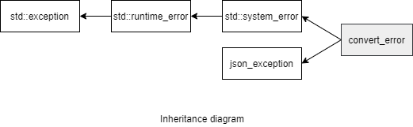

### jsoncons::convert_error

```c++
#include <jsoncons/json_exception.hpp>
```

<br>

`jsoncons::convert_error` defines an exception type for reporting serialization and deserialization failures.



std::exception

#### Constructors

    convert_error(std::error_code ec);

    convert_error(std::error_code ec, std::size_t position);

    convert_error(std::error_code ec,
                        std::size_t line,
                        std::size_t column);

    convert_error(const convert_error& other);

#### Member functions

    std::size_t line() const noexcept
Returns the line number to the end of the text where the exception occurred.
Line numbers start at 1.

    std::size_t column() const noexcept
Returns the column number to the end of the text where the exception occurred.
Column numbers start at 1.

    const char* what() const noexcept
Constructs an error message, including line and column position

#### Inherited from std::system_error

    const std::error_code code() const noexcept
Returns an error code for this exception

### Example

```c++
#include <jsoncons/json.hpp>

using jsoncons::json;

int main()
{
    string s = "[1,2,3,4,]";
    try 
    {
        jsoncons::json j = jsoncons::json::parse(s);
    } 
    catch(const jsoncons::convert_error& e) 
    {
        std::cout << "Caught convert_error with category " 
                  << e.code().category().name() 
                  << ", code " << e.code().value() 
                  << " and message " << e.what() << std::endl;
    }
}
```

Output:
```
Caught convert_error with category json_input, code 1 and message Unexpected value separator ',' at line 1 and column 10
```
