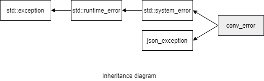

### jsoncons::conv_error

```cpp
#include <jsoncons/conv_error.hpp>
```

<br>

`jsoncons::conv_error` defines an exception type for reporting serialization and deserialization failures.



std::exception

#### Constructors

    conv_error(std::error_code ec);

    conv_error(std::error_code ec, const std::string& what_arg);

    conv_error(std::error_code ec, const char* what_arg);

    conv_error(const conv_error& other);

    conv_error(conv_error&& other);

#### Member functions

    const char* what() const noexcept final
Returns an error message

#### Inherited from std::system_error

    const std::error_code code() const noexcept
Returns an error code for this exception

### Example

```cpp
#include <jsoncons/json.hpp>

using jsoncons::json;

int main()
{
    string s = "[1,2,3,4,]";
    try 
    {
        jsoncons::json j = jsoncons::json::parse(s);
    } 
    catch(const jsoncons::conv_error& e) 
    {
        std::cout << "Caught conv_error with category " 
                  << e.code().category().name() 
                  << ", code " << e.code().value() 
                  << " and message " << e.what() << '\n';
    }
}
```

Output:
```
Caught conv_error with category json_input, code 1 and message Unexpected value separator ',' at line 1 and column 10
```
