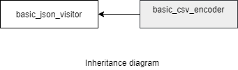

### jsoncons::csv::basic_csv_encoder

```c++
#include <jsoncons_ext/csv/csv_encoder.hpp>

template<
    class CharT,
    class Sink,
    class Allocator=std::allocator<CharT>=std::allocator<CharT>>
> class basic_csv_encoder : public jsoncons::basic_json_visitor<CharT>
```

`basic_csv_encoder` and `basic_compact_json_encoder` are noncopyable and nonmoveable.



Four specializations for common character types and result types are defined:

Type                       |Definition
---------------------------|------------------------------
csv_stream_encoder            |basic_csv_encoder<char,jsoncons::stream_sink<char>>
csv_string_encoder     |basic_csv_encoder<char,jsoncons::string_sink<std::string>>
wcsv_stream_encoder           |basic_csv_encoder<wchar_t,jsoncons::stream_sink<wchar_t>>
wcsv_string_encoder    |basic_csv_encoder<wchar_t,jsoncons::string_sink<std::wstring>>

#### Member types

Type                       |Definition
---------------------------|------------------------------
char_type                  |CharT
sink_type                |Sink
string_view_type           |

#### Constructors

    explicit basic_csv_encoder(Sink&& sink)
Constructs a new csv encoder that is associated with the destination `sink`.

    basic_csv_encoder(Sink&& sink, 
                         const basic_csv_options<CharT>& options)
Constructs a new csv encoder that is associated with the destination `sink` 
and uses the specified [csv options](basic_csv_options.md). 

#### Destructor

    virtual ~basic_csv_encoder() noexcept

#### Inherited from [basic_json_visitor](../basic_json_visitor.md)

#### Member functions

    void flush(); // (1)

    bool begin_object(semantic_tag tag=semantic_tag::none,
                      const ser_context& context=ser_context()); // (2)

    bool begin_object(std::size_t length, 
                      semantic_tag tag=semantic_tag::none, 
                      const ser_context& context = ser_context()); // (3)

    bool end_object(const ser_context& context = ser_context()); // (4)

    bool begin_array(semantic_tag tag=semantic_tag::none,
                     const ser_context& context=ser_context()); // (5)

    bool begin_array(std::size_t length, 
                     semantic_tag tag=semantic_tag::none,
                     const ser_context& context=ser_context()); // (6)

    bool end_array(const ser_context& context=ser_context()); // (7)

    bool key(const string_view_type& name, 
              const ser_context& context=ser_context()); // (8)

    bool null_value(semantic_tag tag = semantic_tag::none,
                    const ser_context& context=ser_context()); // (9) 

    bool bool_value(bool value, 
                    semantic_tag tag = semantic_tag::none,
                    const ser_context& context=ser_context()); // (10) 

    bool string_value(const string_view_type& value, 
                      semantic_tag tag = semantic_tag::none, 
                      const ser_context& context=ser_context()); // (11) 

    bool byte_string_value(const byte_string_view& source, 
                           semantic_tag tag=semantic_tag::none, 
                           const ser_context& context=ser_context()); // (12) (until v0.152.0)

    template <class Source>
    bool byte_string_value(const Source& souce, 
                           semantic_tag tag=semantic_tag::none, 
                           const ser_context& context=ser_context()); // (12) (since v0.152.0)

    template <class Source>
    bool byte_string_value(const Source& souce, 
                           uint64_t ext_tag, 
                           const ser_context& context=ser_context()); // (13) (since v0.152.0)

    bool uint64_value(uint64_t value, 
                      semantic_tag tag = semantic_tag::none, 
                      const ser_context& context=ser_context()); // (14)

    bool int64_value(int64_t value, 
                     semantic_tag tag = semantic_tag::none, 
                     const ser_context& context=ser_context()); // (15)

    bool half_value(uint16_t value, 
                    semantic_tag tag = semantic_tag::none, 
                    const ser_context& context=ser_context()); // (16)

    bool double_value(double value, 
                      semantic_tag tag = semantic_tag::none, 
                      const ser_context& context=ser_context()); // (17)

    bool begin_object(semantic_tag tag,
                      const ser_context& context,
                      std::error_code& ec); // (18)

    bool begin_object(std::size_t length, 
                      semantic_tag tag, 
                      const ser_context& context,
                      std::error_code& ec); // (19)

    bool end_object(const ser_context& context, 
                    std::error_code& ec); // (20)

    bool begin_array(semantic_tag tag, 
                     const ser_context& context, 
                     std::error_code& ec); // (21)

    bool begin_array(std::size_t length, 
                     semantic_tag tag, 
                     const ser_context& context, 
                     std::error_code& ec); // (22)

    bool end_array(const ser_context& context, 
                   std::error_code& ec); // (23)

    bool key(const string_view_type& name, 
              const ser_context& context, 
              std::error_code& ec); // (24)

    bool null_value(semantic_tag tag,
                    const ser_context& context,
                    std::error_code& ec); // (25) 

    bool bool_value(bool value, 
                    semantic_tag tag,
                    const ser_context& context,
                    std::error_code& ec); // (26) 

    bool string_value(const string_view_type& value, 
                      semantic_tag tag, 
                      const ser_context& context,
                      std::error_code& ec); // (27) 

    bool byte_string_value(const byte_string_view& source, 
                           semantic_tag tag, 
                           const ser_context& context,
                           std::error_code& ec); // (28) (until v0.152.0)

    template <class Source>   
    bool byte_string_value(const Source& source, 
                           semantic_tag tag, 
                           const ser_context& context,
                           std::error_code& ec); // (28) (since v0.152.0)

    template <class Source>   
    bool byte_string_value(const Source& source, 
                           uint64_t ext_tag, 
                           const ser_context& context,
                           std::error_code& ec); // (29) (since v0.152.0)

    bool uint64_value(uint64_t value, 
                      semantic_tag tag, 
                      const ser_context& context,
                      std::error_code& ec); // (30)

    bool int64_value(int64_t value, 
                     semantic_tag tag, 
                     const ser_context& context,
                     std::error_code& ec); // (31)

    bool half_value(uint16_t value, 
                    semantic_tag tag, 
                    const ser_context& context,
                    std::error_code& ec); // (32)

    bool double_value(double value, 
                      semantic_tag tag, 
                      const ser_context& context,
                      std::error_code& ec); // (33)

    template <class T>
    bool typed_array(const span<T>& data, 
                     semantic_tag tag=semantic_tag::none,
                     const ser_context& context=ser_context()); // (34)

    bool typed_array(half_arg_t, const span<const uint16_t>& s,
        semantic_tag tag = semantic_tag::none,
        const ser_context& context = ser_context()); // (35)

    bool begin_multi_dim(const span<const size_t>& shape,
                         semantic_tag tag,
                         const ser_context& context); // (36) 

    bool end_multi_dim(const ser_context& context=ser_context()); // (37) 

    template <class T>
    bool typed_array(const span<T>& data, 
                     semantic_tag tag,
                     const ser_context& context,
                     std::error_code& ec); // (38)

    bool typed_array(half_arg_t, const span<const uint16_t>& s,
                     semantic_tag tag,
                     const ser_context& context,
                     std::error_code& ec); // (39)

    bool begin_multi_dim(const span<const size_t>& shape,
                         semantic_tag tag,
                         const ser_context& context, 
                         std::error_code& ec); // (40)

    bool end_multi_dim(const ser_context& context,
                       std::error_code& ec); // (41) 

(1) Flushes whatever is buffered to the destination.

(2) Indicates the begining of an object of indefinite length.
Returns `true` if the consumer wishes to receive more events, `false` otherwise.
Throws a [ser_error](ser_error.md) on parse errors. 

(3) Indicates the begining of an object of known length. 
Returns `true` if the consumer wishes to receive more events, `false` otherwise.
Throws a [ser_error](ser_error.md) on parse errors. 

(4) Indicates the end of an object.
Returns `true` if the consumer wishes to receive more events, `false` otherwise.
Throws a [ser_error](ser_error.md) on parse errors. 

(5) Indicates the beginning of an indefinite length array. 
Returns `true` if the consumer wishes to receive more events, `false` otherwise.
Throws a [ser_error](ser_error.md) on parse errors. 

(6) Indicates the beginning of an array of known length. 
Returns `true` if the consumer wishes to receive more events, `false` otherwise.
Throws a [ser_error](ser_error.md) on parse errors. 

(7) Indicates the end of an array.
Returns `true` if the consumer wishes to receive more events, `false` otherwise.
Throws a [ser_error](ser_error.md) on parse errors. 

(8) Writes the name part of an object name-value pair.
Returns `true` if the consumer wishes to receive more events, `false` otherwise.
Throws a [ser_error](ser_error.md) on parse errors. 

(9) Writes a null value. 
Returns `true` if the consumer wishes to receive more events, `false` otherwise.
Throws a [ser_error](ser_error.md) on parse errors. 

(10) Writes a boolean value.
Returns `true` if the consumer wishes to receive more events, `false` otherwise.
Throws a [ser_error](ser_error.md) on parse errors. 

(11) Writes a text string value.
Returns `true` if the consumer wishes to receive more events, `false` otherwise.
Throws a [ser_error](ser_error.md) on parse errors. 

(12) Writes a byte string value `source` with a generic tag.
Type `Source` must be a container that has member functions `data()` and `size()`, 
and member type `value_type` with size exactly 8 bits (since v0.152.0.)
Returns `true` if the consumer wishes to receive more events, `false` otherwise.
Throws a [ser_error](ser_error.md) on parse errors. 

(13) Writes a byte string value `source` with a format specific tag, `ext_tag`.
Type `Source` must be a container that has member functions `data()` and `size()`, 
and member type `value_type` with size exactly 8 bits (since v0.152.0.)
Returns `true` if the consumer wishes to receive more events, `false` otherwise.
Throws a [ser_error](ser_error.md) on parse errors. 

(14) Writes a non-negative integer value.
Returns `true` if the consumer wishes to receive more events, `false` otherwise.
Throws a [ser_error](ser_error.md) on parse errors. 

(15) Writes a signed integer value.
Returns `true` if the consumer wishes to receive more events, `false` otherwise.
Throws a [ser_error](ser_error.md) on parse errors. 

(16) Writes a half precision floating point value.
Returns `true` if the consumer wishes to receive more events, `false` otherwise.
Throws a [ser_error](ser_error.md) on parse errors. 

(17) Writes a double precision floating point value.
Returns `true` if the consumer wishes to receive more events, `false` otherwise.
Throws a [ser_error](ser_error.md) on parse errors. 

(18)-(33) Same as (2)-(17), except sets `ec` and returns `false` on parse errors.

### Examples

### Serializing an array of json values to a comma delimted file

#### JSON input file 
```json
[
    ["country_code","name"],
    ["ABW","ARUBA"],
    ["ATF","FRENCH SOUTHERN TERRITORIES, D.R. OF"],
    ["VUT","VANUATU"],
    ["WLF","WALLIS & FUTUNA ISLANDS"]
]
```
Note 

- The third array element has a value that contains a comma, in the CSV file this value will be quoted.

#### Serializing the comma delimited file with csv_stream_encoder
```c++
std::string in_file = "input/countries.json";
std::ifstream is(in_file);

json_decoder<json> decoder;
json_reader reader(is,decoder);
reader.read();
json countries = decoder.get_result();

csv_stream_encoder encoder(std::cout);

countries.dump(encoder);
```
#### Output 
```
country_code,name
ABW,ARUBA
ATF,"FRENCH SOUTHERN TERRITORIES, D.R. OF"
VUT,VANUATU
WLF,WALLIS & FUTUNA ISLANDS
```
### Serializing an array of json objects to a tab delimted file

#### JSON input file
```json
[
    {
        "dept":"sales",
        "employee-name":"Smith, Matthew",
        "employee-no":"00000001",
        "note":"",
        "salary":"150,000.00"
    },
    {
        "dept":"sales",
        "employee-name":"Brown, Sarah",
        "employee-no":"00000002",
        "note":"",
        "salary":"89,000.00"
    },
    {
        "dept":"finance",
        "employee-name":"Oberc, Scott",
        "employee-no":"00000003",
        "salary":"110,000.00"
    },
    {
        "dept":"sales",
        "employee-name":"Scott, Colette",
        "employee-no":"00000004",
        "note":"\"Exemplary\" employee\nDependable, trustworthy",
        "comment":"Team player",
        "salary":"75,000.00"
    }
]
```
Note 

- The names in the first object in the array will be used for the header row of the CSV file
- The fourth object has a `note` member whose value contains escaped quotes and an escaped new line character, in the CSV file, this value will be quoted, and it will contain a new line character and escaped quotes.

#### Dump json value to a tab delimited file
```c++
std::string in_file = "input/employees.json";
std::ifstream is(in_file);

json_decoder<json> decoder;
csv_options options;
options.field_delimiter = '\t';

json_reader reader(is,decoder);
reader.read();
json employees = decoder.get_result();

csv_stream_encoder encoder(std::cout,options);

employees.dump(encoder);
```
#### Tab delimited output file
```
dept    employee-name   employee-no     note    salary
sales   Smith, Matthew  00000001                150,000.00
sales   Brown, Sarah    00000002                89,000.00
finance Oberc, Scott    00000003                110,000.00
sales   Scott, Colette  00000004        ""Exemplary"" employee
Dependable, trustworthy 75,000.00
```

#### Dump json value to csv file

```c++
#include <jsoncons/json.hpp>
#include <jsoncons_ext/csv/csv_encoder.hpp>

using namespace jsoncons;

int main()
{
    const json books = json::parse(R"(
    [
        {
            "title" : "Kafka on the Shore",
            "author" : "Haruki Murakami",
            "price" : 25.17
        },
        {
            "title" : "Women: A Novel",
            "author" : "Charles Bukowski",
            "price" : 12.00
        },
        {
            "title" : "Cutter's Way",
            "author" : "Ivan Passer"
        }
    ]
    )");

    csv_options options;
    options.column_names("author,title,price");

    csv_stream_encoder encoder(std::cout, options);

    books.dump(encoder);
}
```

Output:

```csv
author,title,price
Haruki Murakami,Kafka on the Shore,25.17
Charles Bukowski,Women: A Novel,12.0
Ivan Passer,Cutter's Way,
```

### See also

[byte_string_view](../byte_string_view.md)
