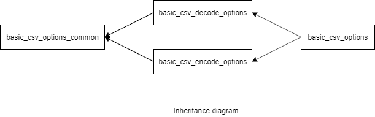

### jsoncons::csv::basic_csv_options

```c++
#include <jsoncons_ext/csv/csv_options.hpp>

template< 
    class CharT
> class basic_csv_options;
```

<br>



Specifies options for reading and writing CSV data. 

Option|Reading|Writing
------|-------|----------
nan_to_str|Substitute string with `NaN`, if enabled|Sets a string replacement for `NaN` when writing JSON
inf_to_str|Substitute string with `infinity`, if enabled|Sets a string replacement for infinity when writing JSON
neginf_to_str|Substitute string with `negative infinity`, if enabled|Sets a string replacement for negative infinity when writing JSON
nan_to_num| |Sets a number replacement for `NaN` when writing JSON
inf_to_num| |Sets a number replacement for `Infinity` when writing JSON
neginf_to_num| |Sets a number replacement for `Negative Infinity` when writing JSON
line_delimiter|Not used. When reading, the parser accepts `\n`, `\r` and `\r\n`.|An end-of-line string that marks the end of a row. Default is `\n`.
field_delimiter|A character that indicates the end of a field. Default is `,`.|Character to separate values.
subfield_delimiter|A character that indicates the end of a single value in a multi-valued field. Default is no multi-valued fields.|Character to write between items in an array value.
quote_char|A character to quote fields. Default is the double quote character `"`|A character to quote fields.
quote_escape_char|A character to escape quote characters occuring inside quoted fields. The default is the double quote character (i.e. the quote character is doubled).|Character to escape quote characters occurring inside quoted fields. 
quote_style| |Indicates what [quote_style](quote_style_kind.md) to use when quoting fields. Default is minimal.
column_names|Use these column names when reading the file.|Write these column names to the header line.
header_lines|Number of header lines in the CSV text. Defaults to 1 if assume_header is true, otherwise 0|
assume_header|Assume first row in file is header, use field names to construct objects. Default is `false`.|
ignore_empty_values|Do not read CSV fields that have empty values. Default is `false`.|
ignore_empty_lines|If set to true, all lines in the file that are empty (apart from record delimiter characters) are ignored. To ignore lines with only spaces or tabs, set trim to true. Default is `true`.|
trim_leading|Trim leading whitespace. Default is `false`.|
trim_trailing|Trim trailing whitespace. Default is `false`.|
trim|Trim both leading and trailing whitespace. Default is `false`.|
trim_leading_inside_quotes|Trim leading whitespace inside quote characters. Default is `false`.|
trim_trailing_inside_quotes|Trim trailing whitespace inside quote characters. Default is `false`.|
trim_inside_quotes|Trim both leading and trailing whitespace inside quote characters. Default is `false`.|
unquoted_empty_value_is_null|Replace empty field with json null value. Default is `false`.|
infer_types|Infer null, true, false, integers and floating point values in the CSV source. Default is `true`.|
lossless_number|If set to `true`, parse numbers with exponents and fractional parts as strings with semantic tagging `semantic_tag::bigdec`. Default is `false`.|
comment_starter|Character to comment out a line, must be at column 1. Default is no comments.|
mapping|Indicates what [mapping kind](mapping_kind.md) to use when parsing a CSV file into a `basic_json`. If assume_header is true or column_names is not empty, defaults to `mapping_kind::n_objects`, otherwise `mapping_kind::n_rows`.|
max_lines|Maximum number of lines to read. Default is unlimited.|
column_types|A comma separated list of data types corresponding to the columns in the file. The following data types are supported: string, integer, float and boolean. Example: "bool,float,string"}|
column_defaults|A comma separated list of strings containing default json values corresponding to the columns in the file. Example: "false,0.0,"\"\""|
float_format| |Overrides [floating point format](../float_chars_format.md) when serializing to CSV. The default is [float_chars_format::general](float_chars_format.md).
precision| |Overrides floating point precision when serializing csv from json. The default is shortest representation.

Typedefs for common character types are provided:

Type                |Definition
--------------------|------------------------------
`csv_options`        |`basic_csv_options<char>`
`wcsv_options`       |`basic_csv_options<wchar_t>`

Member type                         |Definition
------------------------------------|------------------------------
`char_type`|`CharT`
`string_type`|`std::basic_string<CharT>`

#### Constructors

    basic_csv_options()
Constructs a `basic_csv_options` with default values. 

    basic_csv_options(const basic_csv_options& other)
Copy constructor. 

    basic_csv_options(basic_csv_options&& other)
Move constructor. 

#### Modifiers

    basic_json_options& nan_to_str(const string_type& value, bool enable_inverse = true); 
Sets a string replacement for `NaN` when writing JSON, and indicate whether it is also
to be used when reading JSON.

    basic_json_options& inf_to_str(const string_type& value, bool enable_inverse = true); 
Sets a string replacement for infinity when writing JSON, and indicate whether it is also
to be used when reading JSON.

    basic_json_options& neginf_to_str(const string_type& value, bool enable_inverse = true); // (4)
Sets a string replacement for negative infinity when writing JSON, and indicate whether it is also
to be used when reading JSON.

    basic_json_options& nan_to_num(const string_type& value); 
Sets a number replacement for `NaN` when writing JSON

    basic_json_options& inf_to_num(const string_type& value); 
Sets a number replacement for `Infinity` when writing JSON

    basic_json_options& neginf_to_num(const string_type& value); 
Sets a number replacement for `Negative Infinity` when writing JSON

    basic_csv_options& float_format(float_chars_format value);
Overrides [floating point format](../float_chars_format.md) when serializing to CSV. The default is [float_chars_format::general](float_chars_format.md).

    basic_csv_options& precision(int8_t value);
Overrides floating point precision when serializing csv from json. The default is shortest representation.

    basic_csv_options& header_lines(std::size_t value);
Number of header lines in the CSV text. Defaults to 1 if assume_header is true, otherwise 0

    basic_csv_options& assume_header(bool value);
Assume first row in file is header, use field names to construct objects. Default is `false`.         

    basic_csv_options& ignore_empty_values(bool value);
Do not read CSV fields that have empty values. Default is `false`.         

    basic_csv_options& ignore_empty_lines(bool value);
If set to true, all lines in the file that are empty (apart from record delimiter characters) are ignored. To ignore lines with only spaces or tabs, set trim to true. Default is `true`.         

    basic_csv_options& trim_leading(bool value);
Trim leading whitespace. Default is `false`.         

    basic_csv_options& trim_trailing(bool value);
Trim trailing whitespace. Default is `false`.         

    basic_csv_options& trim(bool value);
Trim both leading and trailing whitespace. Default is `false`.        

    basic_csv_options& trim_leading_inside_quotes(bool value);
Trim leading whitespace inside quote characters. Default is `false`.         

    basic_csv_options& trim_trailing_inside_quotes(bool value);
Trim trailing whitespace inside quote characters. Default is `false`.         

    basic_csv_options& trim_inside_quotes(bool value);
Trim both leading and trailing whitespace inside quote characters. Default is `false`.        

    basic_csv_options& unquoted_empty_value_is_null(bool value);
Replace empty field with json null value. Default is `false`.         

    basic_csv_options& column_names(const string_type& value);
A comma separated list of names corresponding to the fields in the file. Example: "bool-field,float-field,string-field"

    basic_csv_options& column_types(const string_type& value);
A comma separated list of data types corresponding to the columns in the file. The following data types are supported: string, integer, float and boolean. Example: "bool,float,string"}

    basic_csv_options& column_defaults(const string_type& value);
A comma separated list of strings containing default json values corresponding to the columns in the file. Example: "false,0.0,"\"\""

    basic_csv_options& field_delimiter(char_type value);
A delimiter character that indicates the end of a field. Default is `,`             

    basic_csv_options& subfield_delimiter(char_type value);
A delimiter character that indicates the end of a single value in a multi-valued field. Default is no multi-valued fields.

    basic_csv_options& line_delimiter(string_type value);
String to write between records. Default is `\n`.  

    basic_csv_options& quote_char(char_type value);
Quote character. Default is quote character `"`             

    basic_csv_options& infer_types(bool value);
Infer null, true, false, integers and floating point values in the CSV source. Default is `true`.

    basic_csv_options& lossless_number(bool value); 
If set to `true`, parse numbers with exponents and fractional parts as strings with semantic tagging `semantic_tag::bigdec`. Default is `false`.

    basic_csv_options& quote_escape_char(char_type value);
Character to escape quote character (by default the quote character is doubled). Default is quote character `"`.

    basic_csv_options& comment_starter(char_type value);
Character to comment out a line, must be at column 1. Default is no comments.

    basic_csv_options& quote_style(quote_style_kind value);
Indicates what [quote_style](quote_style_kind.md) to use when quoting fields. Default is minimal.

    basic_csv_options& mapping(mapping_kind value);
Indicates what [mapping kind](mapping_kind.md) to use when parsing a CSV file into a `basic_json`. If assume_header is true or column_names is not empty, defaults to `mapping_kind::n_rows`, otherwise `mapping_kind::n_columns`.

    basic_csv_options& max_lines(std::size_t value);
Maximum number of lines to read. Default is unlimited.


