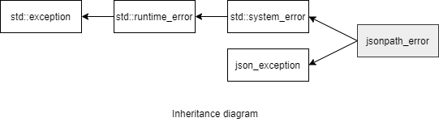

### jsoncons::jmespath::jmespath_error

```c++
#include <jsoncons_ext/jmespath/jmespath_error.hpp>
```

<br>

`jsoncons::jmespath::jmespath_error` defines an exception type for reporting failures in jmespath queries.



#### Constructors
```c++
jmespath_error(std::error_code ec);

jmespath_error(std::error_code ec, std::size_t line, std::size_t column);

jmespath_error(const jmespath_error& other);
```
#### Member functions

    std::size_t line() const noexcept
Returns the line number to the end of the text where the exception occurred.
Line numbers start at 1.

    std::size_t column() const noexcept
Returns the column number to the end of the text where the exception occurred.
Column numbers start at 1.

    const char* what() const noexcept
Constructs an error message, including line and column position

#### Inherited from std::system_error

    const std::error_code code() const noexcept
Returns an error code for this exception

### Example


