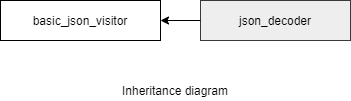

### jsoncons::json_decoder

```c++
#include <jsoncons/json_decoder.hpp>

template <class Json,class WorkAllocator>
json_decoder
```



#### Member types

Member type                         |Definition
------------------------------------|------------------------------
`result_allocator_type`|Json::allocator_type
`work_allocator_type`|WorkAllocator

#### Constructors

    json_decoder(const result_allocator_type& rallocator = result_allocator_type(), 
                 const work_allocator_type& wallocator = work_allocator_type())

#### Member functions

    allocator_type get_allocator() const
Returns the allocator associated with the json value.

    bool is_valid() const
Checks if the `deserializer` contains a valid json_type value. The initial `is_valid()` is false, becomes `true` when a `do_end_document` event is received, and becomes false when `get_result()` is called.

    Json get_result()
Returns the json value `v` stored in the `deserializer` as `std::move(v)`. If before calling this function `is_valid()` is false, the behavior is undefined. After `get_result()` is called, 'is_valid()' becomes false.

### See also

- [json_content_handler](json_content_handler.md)

