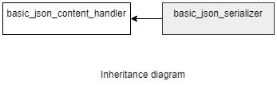

### jsoncons::basic_json_serializer

```c++
template<
    class CharT,
    class Result>
> basic_json_serializer : public jsoncons::basic_json_content_handler<CharT>

template<
    class CharT,
    class Result>
> basic_json_compressed_serializer : public jsoncons::basic_json_content_handler<CharT>
```

`basic_json_serializer` and `basic_json_compressed_serializer` are noncopyable and nonmoveable.

#### Header

    #include <jsoncons/json_serializer.hpp>



Four specializations for common character types and result types are defined
for both the pretty print and compressed serializers:

Type                       |Definition
---------------------------|------------------------------
json_serializer            |basic_json_serializer<char,jsoncons::text_stream_result<char>>
json_string_serializer     |basic_json_serializer<char,jsoncons::string_result<std::string>>
wjson_serializer           |basic_json_serializer<wchar_t,jsoncons::text_stream_result<wchar_t>>
wjson_string_serializer    |basic_json_serializer<wchar_t,jsoncons::string_result<std::wstring>>
json_compressed_serializer            |basic_json_compressed_serializer<char,jsoncons::text_stream_result<char>>
json_compressed_string_serializer     |basic_json_compressed_serializer<char,jsoncons::string_result<std::string>>
wjson_compressed_serializer           |basic_json_compressed_serializer<wchar_t,jsoncons::text_stream_result<wchar_t>>
wjson_compressed_string_serializer    |basic_json_compressed_serializer<wchar_t,jsoncons::string_result<std::wstring>>

#### Member types

Type                       |Definition
---------------------------|------------------------------
char_type                  |CharT
result_type                |Result
string_view_type           |

#### Constructors

    explicit basic_json_serializer(result_type result)
Constructs a new serializer that is associated with the output adaptor `result`.

    basic_json_serializer(result_type result, 
                          const basic_json_write_options<CharT>& options)
Constructs a new serializer that is associated with the output adaptor `result` 
and uses the specified [json options](json_options.md). 

#### Destructor

    virtual ~basic_json_serializer()

### Inherited from [basic_json_content_handler](../json_content_handler.md)

#### Member functions

    bool begin_object(semantic_tag_type tag=semantic_tag_type::none,
                      const serializing_context& context=null_serializing_context()); 

    bool begin_object(size_t length, 
                      semantic_tag_type tag=semantic_tag_type::none,
                      const serializing_context& context=null_serializing_context()); 

    bool end_object(const serializing_context& context = null_serializing_context())

    bool begin_array(semantic_tag_type tag=semantic_tag_type::none,
                     const serializing_context& context=null_serializing_context()); 

    bool begin_array(semantic_tag_type tag=semantic_tag_type::none,
                     const serializing_context& context=null_serializing_context()); 

    bool end_array(const serializing_context& context=null_serializing_context()); 

    bool name(const string_view_type& name, 
              const serializing_context& context=null_serializing_context()); 

    bool string_value(const string_view_type& value, 
                      semantic_tag_type tag = semantic_tag_type::none, 
                      const serializing_context& context=null_serializing_context()); ;

    bool byte_string_value(const byte_string_view& b, 
                           semantic_tag_type tag=semantic_tag_type::none, 
                           const serializing_context& context=null_serializing_context()); 

    bool byte_string_value(const uint8_t* p, size_t size, 
                           semantic_tag_type tag=semantic_tag_type::none, 
                           const serializing_context& context=null_serializing_context()); 

    bool big_integer_value(const string_view_type& s, 
                           const serializing_context& context=null_serializing_context());  

    bool big_decimal_value(const string_view_type& s, 
                           const serializing_context& context=null_serializing_context());  

    bool date_time_value(const string_view_type& s, 
                         const serializing_context& context=null_serializing_context());  

    bool timestamp_value(int64_t val, 
                         const serializing_context& context=null_serializing_context());  

    bool int64_value(int64_t value, 
                     semantic_tag_type tag = semantic_tag_type::none, 
                     const serializing_context& context=null_serializing_context()); ;

    bool uint64_value(uint64_t value, 
                      semantic_tag_type tag = semantic_tag_type::none, 
                      const serializing_context& context=null_serializing_context()); 

    bool double_value(double value, 
                      semantic_tag_type tag = semantic_tag_type::none, 
                      const serializing_context& context=null_serializing_context()); 

    bool bool_value(bool value, 
                    semantic_tag_type tag = semantic_tag_type::none,
                    const serializing_context& context=null_serializing_context());  

    bool null_value(semantic_tag_type tag = semantic_tag_type::none,
                    const serializing_context& context=null_serializing_context());  

    void flush()

### Examples

### Feeding json events directly to a `json_serializer`
```c++
#include <iostream>
#include <boost/numeric/ublas/matrix.hpp>
#include <jsoncons/json_serializer.hpp>

using namespace jsoncons;
using boost::numeric::ublas::matrix;

int main()
{
    matrix<double> A(2, 2);
    A(0, 0) = 1;
    A(0, 1) = 2;
    A(1, 0) = 3;
    A(1, 1) = 4;

    json_options options;
    json_serializer os(std::cout, options); 
    os.begin_array();
    for (size_t i = 0; i < A.size1(); ++i)
    {
        os.begin_array();
        for (size_t j = 0; j < A.size2(); ++j)
        {
            os.double_value(A(i, j));
        }
        os.end_array();
    }
    os.end_array();

    return 0;
}
```

Output:

```json
[
    [1,2],
    [3,4]
]
```
