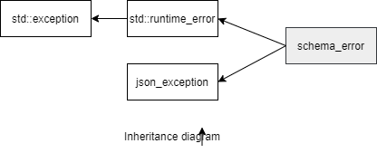

### jsoncons::jsonschema::schema_error

```c++
#include <jsoncons_ext/jsonschema/jsonschema_error.hpp>
```

<br>

`jsoncons::jsonschema::schema_error` defines an exception type for reporting failures in jsonschema operations.



#### Constructors

    schema_error(const std::string& message);

#### Member functions

    const char* what() const noexcept
Returns an error message


