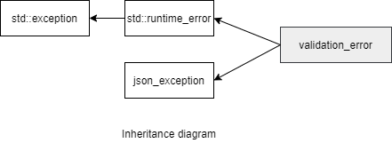

### jsoncons::jsonschema::validation_error

```c++
#include <jsoncons_ext/jsonschema/jsonschema_error.hpp>
```

<br>

`jsoncons::jsonschema::validation_error` defines an exception type for reporting violations of a JSON Schema.



#### Constructors

    validation_error(const std::string& message);

#### Member functions

    const char* what() const noexcept
Returns an error message


