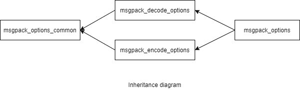

### jsoncons::msgpack::msgpack_options

```c++
#include <jsoncons_ext/msgpack/msgpack_options.hpp>

class msgpack_options;
```

<br>



Specifies options for reading and writing CBOR.

#### Constructors

    msgpack_options()
Constructs a `msgpack_options` with default values. 

#### Modifiers

    void max_nesting_depth(int depth)
The maximum nesting depth allowed when decoding and encoding MessagePack. 
Default is 1024. Parsing can have an arbitrarily large depth
limited only by available memory. Serializing a [basic_json](../basic_json.md) to
MessagePack is limited by stack size.

