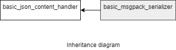

### jsoncons::bson::basic_bson_serializer

```c++
template<
    class CharT,
    class Result>
> class basic_bson_serializer : public jsoncons::basic_json_content_handler<CharT>
```

`basic_bson_serializer` is noncopyable and nonmoveable.

#### Header

    #include <jsoncons_ext/bson/bson_serializer.hpp>



Four specializations for common character types and result types are defined:

Type                       |Definition
---------------------------|------------------------------
bson_serializer            |basic_bson_serializer<char,jsoncons::binary_stream_result>
bson_buffer_serializer     |basic_bson_serializer<char,jsoncons::binary_buffer_result>
wbson_serializer           |basic_bson_serializer<wchar_t,jsoncons::binary_stream_result>
wbson_buffer_serializer    |basic_bson_serializer<wchar_t,jsoncons::binary_buffer_result>

#### Member types

Type                       |Definition
---------------------------|------------------------------
char_type                  |CharT
result_type                |Result
string_view_type           |

#### Constructors

    explicit basic_bson_serializer(result_type result)
Constructs a new serializer that writes to the specified result.

#### Destructor

    virtual ~basic_bson_serializer()

### Inherited from [basic_json_content_handler](../json_content_handler.md)

#### Member functions

    bool begin_object(semantic_tag tag=semantic_tag::none,
                      const ser_context& context=null_ser_context()); 

    bool begin_object(size_t length, 
                      semantic_tag tag=semantic_tag::none,
                      const ser_context& context=null_ser_context()); 

    bool end_object(const ser_context& context = null_ser_context())

    bool begin_array(semantic_tag tag=semantic_tag::none,
                     const ser_context& context=null_ser_context()); 

    bool begin_array(semantic_tag tag=semantic_tag::none,
                     const ser_context& context=null_ser_context()); 

    bool end_array(const ser_context& context=null_ser_context()); 

    bool name(const string_view_type& name, 
              const ser_context& context=null_ser_context()); 

    bool string_value(const string_view_type& value, 
                      semantic_tag tag = semantic_tag::none, 
                      const ser_context& context=null_ser_context()); ;

    bool byte_string_value(const byte_string_view& b, 
                           semantic_tag tag=semantic_tag::none, 
                           const ser_context& context=null_ser_context()); 

    bool byte_string_value(const uint8_t* p, size_t size, 
                           semantic_tag tag=semantic_tag::none, 
                           const ser_context& context=null_ser_context()); 

    bool big_integer_value(const string_view_type& s, 
                           const ser_context& context=null_ser_context());  

    bool big_decimal_value(const string_view_type& s, 
                           const ser_context& context=null_ser_context());  

    bool date_time_value(const string_view_type& s, 
                         const ser_context& context=null_ser_context());  

    bool timestamp_value(int64_t val, 
                         const ser_context& context=null_ser_context());  

    bool int64_value(int64_t value, 
                     semantic_tag tag = semantic_tag::none, 
                     const ser_context& context=null_ser_context()); ;

    bool uint64_value(uint64_t value, 
                      semantic_tag tag = semantic_tag::none, 
                      const ser_context& context=null_ser_context()); 

    bool double_value(double value, 
                      semantic_tag tag = semantic_tag::none, 
                      const ser_context& context=null_ser_context()); 

    bool bool_value(bool value, 
                    semantic_tag tag = semantic_tag::none,
                    const ser_context& context=null_ser_context());  

    bool null_value(semantic_tag tag = semantic_tag::none,
                    const ser_context& context=null_ser_context());  

    void flush()

### Examples


