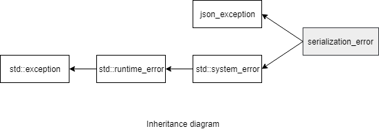

### jsoncons::serialization_error

#### Header

    #include <jsoncons/json_exception.hpp>

`jsoncons::serialization_error` defines an exception type for reporting serialization and deserialization failures.

std::exception

#### Constructors

    serialization_error(std::error_code ec);

    serialization_error(std::error_code ec, size_t position);

    serialization_error(std::error_code ec,
                        size_t line,
                        size_t column);

    serialization_error(const serialization_error& other);

#### Member functions

    size_t line_number() const noexcept
Returns the line number to the end of the text where the exception occurred.
Line numbers start at 1.

    size_t column_number() const noexcept
Returns the column number to the end of the text where the exception occurred.
Column numbers start at 1.

    const char* what() const
Constructs an error message, including line and column position

#### Inherited from std::system_error

    const std::error_code code() const noexcept
Returns an error code for this exception

### Example

    #include <jsoncons/json.hpp>

    using jsoncons::json;

    int main()
    {
        string s = "[1,2,3,4,]";
        try 
        {
            jsoncons::json val = jsoncons::json::parse(s);
        } 
        catch(const jsoncons::serialization_error& e) 
        {
            std::cout << "Caught serialization_error with category " 
                      << e.code().category().name() 
                              << ", code " << e.code().value() 
                      << " and message " << e.what() << std::endl;
        }
    }

Output:

    Caught serialization_error with category json_input, code 1 and message Unexpected value separator ',' at line 1 and column 10
