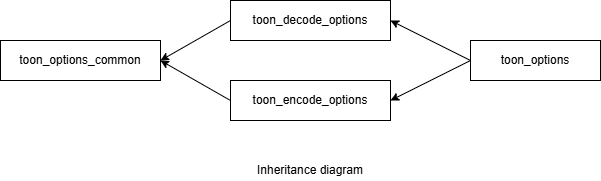

### jsoncons::toon::toon_options

```cpp
#include <jsoncons_ext/toon/toon_options.hpp>

class toon_options;
```

<br>



Specifies options for reading and writing [TOON](https://github.com/toon-format/toon).

#### Constructors

    toon_options()
Constructs a `toon_options` with default values. 

#### Modifiers

    void max_nesting_depth(int value)
The maximum nesting depth allowed when decoding and encoding TOON. 
Default is 1024. 
    void delimiter(char value)
Delimiter character for arrays. Default is **','**.
    void indent(int value)
Number of spaces to indent each level. Default is **2**.
    void length_marker(jsoncons::optional<char> value)
Optional marker for prefixing array lengths. Default is none.
