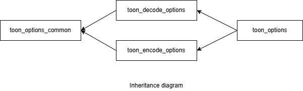

### jsoncons::toon::toon_options

```cpp
#include <jsoncons_ext/toon/toon_options.hpp>

class toon_options;
```

<br>



Specifies options for reading and writing [toon-format](https://github.com/toon-format/toon).


Option|Reading|Writing|Default|comment
------|-------|-------|-------|------
delimiter|Default delimiter character for arrays|Delimiter character for arrays|**,**|
indent|Number of spaces to indent each level|Number of spaces to indent each level.|2|
length_marker|&nbsp;|Optional marker for prefixing array lengths|None|
strict|Strict mode|&nbsp;|**true**|
max_nesting_depth|Maximum nesting depth allowed when reading toon-format|Maximum nesting depth allowed when writing toon-format|**1024**|

#### Constructors

    toon_options()
Constructs a `toon_options` with default values. 

#### Setters

    toon_options& delimiter(char value) 
    toon_options& indent(int value) 
    toon_options& length_marker(jsoncons::optional<char> value) 
    toon_options& strict(bool value) 
    toon_options& max_nesting_depth(int depth) 

