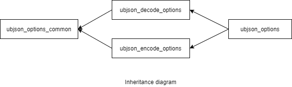

### jsoncons::ubjson::ubjson_options

```c++
#include <jsoncons_ext/ubjson/ubjson_options.hpp>

class ubjson_options;
```

<br>



Specifies options for reading and writing CBOR.

#### Constructors

    ubjson_options()
Constructs a `ubjson_options` with default values. 

#### Modifiers

    void max_items(std::size_t value)    
While parsing, the maximum number of items allowed in a UBJSON object or array. 
Default is 16,777,216.     

    void max_nesting_depth(int value)
The maximum nesting depth allowed when decoding and encoding UBJSON. 
Default is 1024. Parsing can have an arbitrarily large depth
limited only by available memory. Serializing a [basic_json](../basic_json.md) to
UBJSON is limited by stack size.

